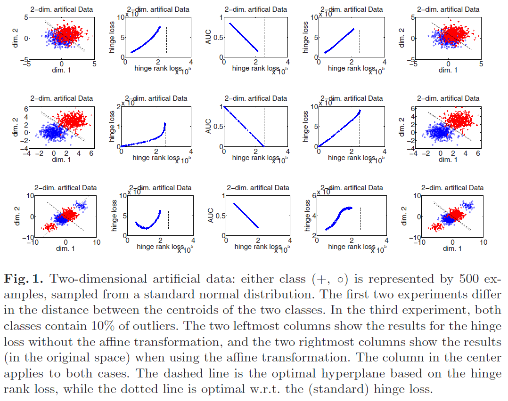

\DeclareMathOperator*{\argmin}{argmin}
\DeclareMathOperator*{\argmax}{argmax}


Steck, 2007, **Hinge rank loss and the are under the ROC curve**, *European Conference on Machine Learning*. [pdf](https://link.springer.com/chapter/10.1007/978-3-540-74958-5_33)


***


## Notation


  * Dataset
    + $D = \{ (x_i, y_i) \} _{i=1}^{N}$
    + Class labels $y_i \in \{ -1, +1 \}$
    + The number of positive and negative examples $N^+$ and $N^-$ respectively
  * Classifier $C$
    + Real-valued output $c_i = C(x_i)$
    + Assume that there are no ties, i.e., $c_i \neq c_j$ for all $i, j$
    + Classification rule given the real-valued threshold $\theta$: $sign(c_i - \theta)$
  * Rank-version of $C$
    + The smallest output-value gets assigned the lowest rank
    + Let $r_i \in \{ 1, \cdots, N \}$ be the rank of $x_i$
    + $r_j^+$: ranks of the positive examples, $j = 1, \cdots, N^+$
    + $r_k^-$: ranks of the negative examples, $k = 1, \cdots, N^-$
    + Rank-threshold $\tilde{\theta} = \max{\{ r_i: c_i \leq \theta \}} + 0.5 = \min{\{ r_i: c_i > \theta \}} - 0.5$
    + Classification rule: $sign(r_i - \tilde{\theta})$


***


## AUC


\begin{equation}
\begin{split}
AUC & = \frac{1}{N^+ N^-} \sum_{j=1}^{N^+} \sum_{k=1}^{N^-} I(r_j^+ > r_k^-) \\
& = \frac{1}{N^+ N^-} \sum_{j=1}^{N^+} (r_j^+ - j) \\
& = \frac{1}{N^+ N^-} \left( \left( \sum_{j=1}^{N^+} r_j^+ \right) - \binom{N^+ + 1}{2} \right)
\end{split}
\end{equation}


***


## Hinge Rank Loss and AUC


  * Hinge loss
    + $(a)_+ = a$ if $a > 0$, and 0 otherwise
    
\begin{equation}
L_{\theta}^{H} = \sum_{i=1}^{N} (1 - y_i (c_i - \theta))_+
\end{equation}

  * Hinge rank loss
  
\begin{equation}
L_{\tilde{\theta}}^{HR} = \sum_{i=1}^{N} (0.5 - y_i (r_i - \tilde{\theta}))_+
\end{equation}
    + Since $r_i - \tilde{\theta} \in \{ \pm0.5, \pm1.5, \cdots\}$, $(0.5 - y_i (r_i - \tilde{\theta}))_+ \in \{ 0, 1, 2, \cdots\}$
    + No loss is incurred for any correctly classified example

```{r}
n <- 10
y <- sample(x = c(-1, 1), size = n, replace = TRUE)
c <- runif(n = length(y), min = -1.5, max = 1.5)
c <- round(x = c, digits = 2)
r <- rank(x = c)


theta <- 0
# max(r[c <= theta]) + 0.5 == min(r[c > theta]) - 0.5
t.theta <- min(r[c > theta]) - 0.5


loss.h <- c()
loss.hr <- c()
for (i in 1:length(y)) {
  loss.h[i] <- max(0, 1 - y[i] * (c[i] - theta))
  loss.hr[i] <- max(0, 0.5 - (y[i] * (r[i] - t.theta)))
}


ix <- order(c, decreasing = TRUE)
cbind(y, c, r, "L^H" = loss.h, "L^HR" = loss.hr)[ix,]
```

  * For the following, let $\bar{\theta} = \tilde{\theta} - 0.5 \in \mathbb{N}$
  * **Proposition 1.** For the hinge rank loss holds the following with the number of false negatives $N_{\bar{\theta}}^{fn} = \sum_{j=1}^{N^+} I(r_j^+ \leq \bar{\theta})$

\begin{equation}
L_{\bar{\theta}}^{HR} = N_{\bar{\theta}}^{fn} + N^+ \bar{\theta} + \binom{N-\bar{\theta} + 1}{2} - \sum_{j=1}^{N^+} r_j^+
\end{equation}

  * **Proposition 2.** The AUC is related to the hinge rank loss and the number of false negatives as follows where ${const}_{D,\bar{\theta}} = \binom{N^- - \bar{\theta} + 1}{2}$ if $N^- \geq \bar{\theta}$ and ${const}_{D,\bar{\theta}} = \binom{\bar{\theta} - N^-}{2}$ otherwise; ${const}_{D,\bar{\theta}}$ is a constant given the data $D$ and the rank-threshold $\bar{\theta}$, i.e. it is independent of the classifier $C$

\begin{equation}
\begin{split}
AUC & = 1 - \frac{L_{\bar{\theta}}^{HR} - {const}_{D,\bar{\theta}} - N_{\bar{\theta}}^{fn}}{N^+ N^-} \\
AUC & \geq 1 - \frac{L_{\bar{\theta}}^{HR} - {const}_{D,\bar{\theta}}}{N^+ N^-}
\end{split}
\end{equation}

  * **Proposition 3.** The lower bound in Proposition 2. is tight in the asymptotic limit $N \to \infty$ under the mild assumption that $N^+ / N^- \to \epsilon$, where $0 < \epsilon < 1$ is a constant
  * **Corollary.** For the choice $\bar{\theta} = N^-$, the relation among AUC, hinge rank loss and 0-1 loss reads

\begin{equation}
\begin{split}
AUC & = 1 - \frac{L_{N^-}^{HR} - 0.5 \times L_{N^-}^{0-1}}{N^+ N^-} \\
AUC & \geq 1 - \frac{L_{N^-}^{HR}}{N^+ N^-}
\end{split}
\end{equation}


***


## Hinge Loss as a Parametric Approximation


  * While minimizing the hinge rank loss would provide an asymptotically tight bound on the AUC, this is computationally expensive
  * Hinge rank loss may simply be approximated by its parametric counterpart, the standard hinge loss
  * Hmmmmmm...


***


## Experiments


  * Preprocessing the data by an affine transformation
  * Linear classifier (hyperplane)
<br>

<br>

<br>


***


## Further Study


  * Schölkopf et al., 1998, **Nonlinear component analysis as a kernel eigenvalue problem**, *Neural Computation*. [pdf](http://alex.smola.org/papers/1998/SchSmoMul98.pdf)
  * Shivaswamy and Jebara, 2007, **Ellipsoidal machines**, *Artificial Intelligence and Statistics*. [pdf](http://proceedings.mlr.press/v2/shivaswamy07a/shivaswamy07a.pdf)

