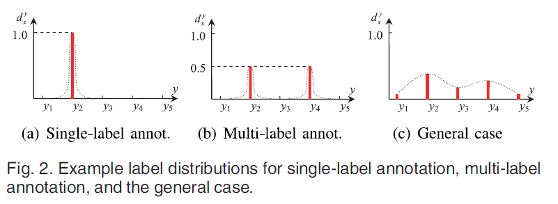
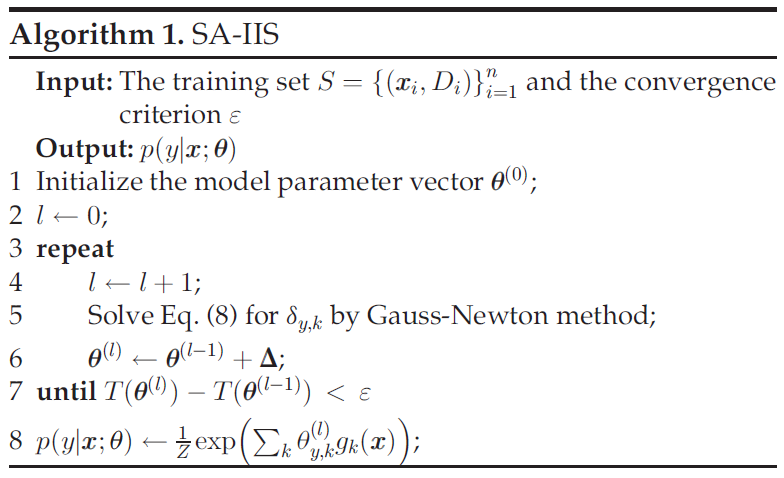
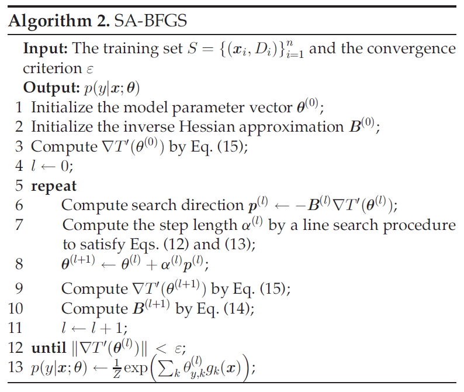
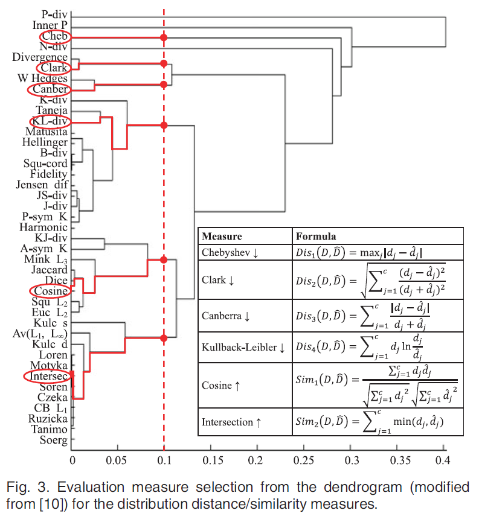
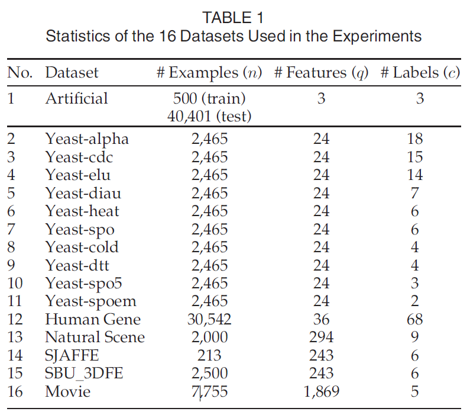
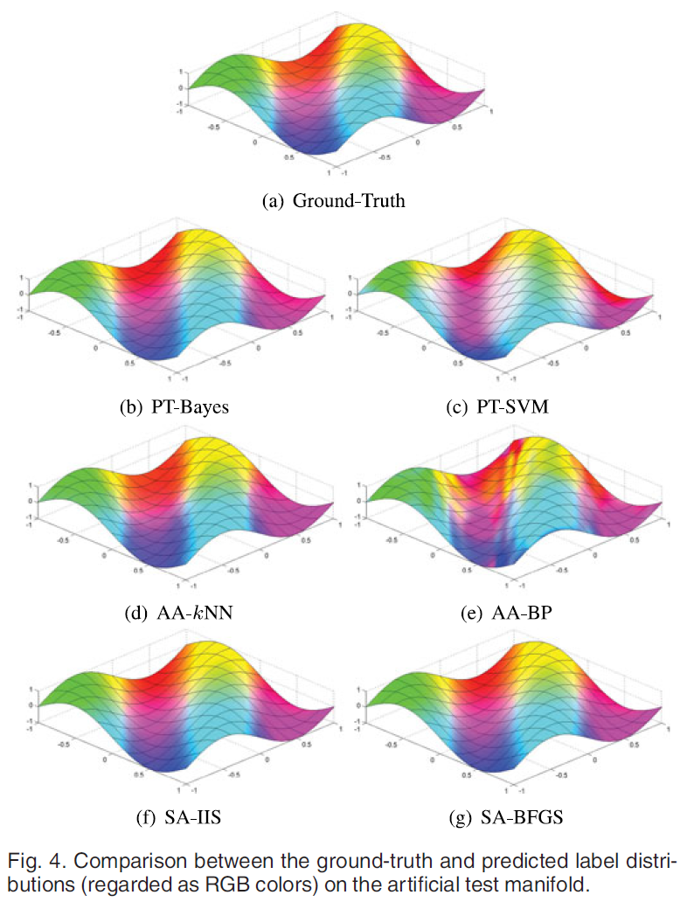
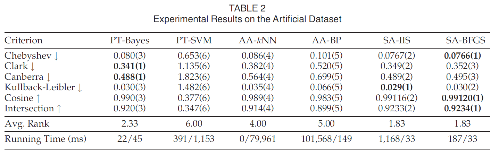
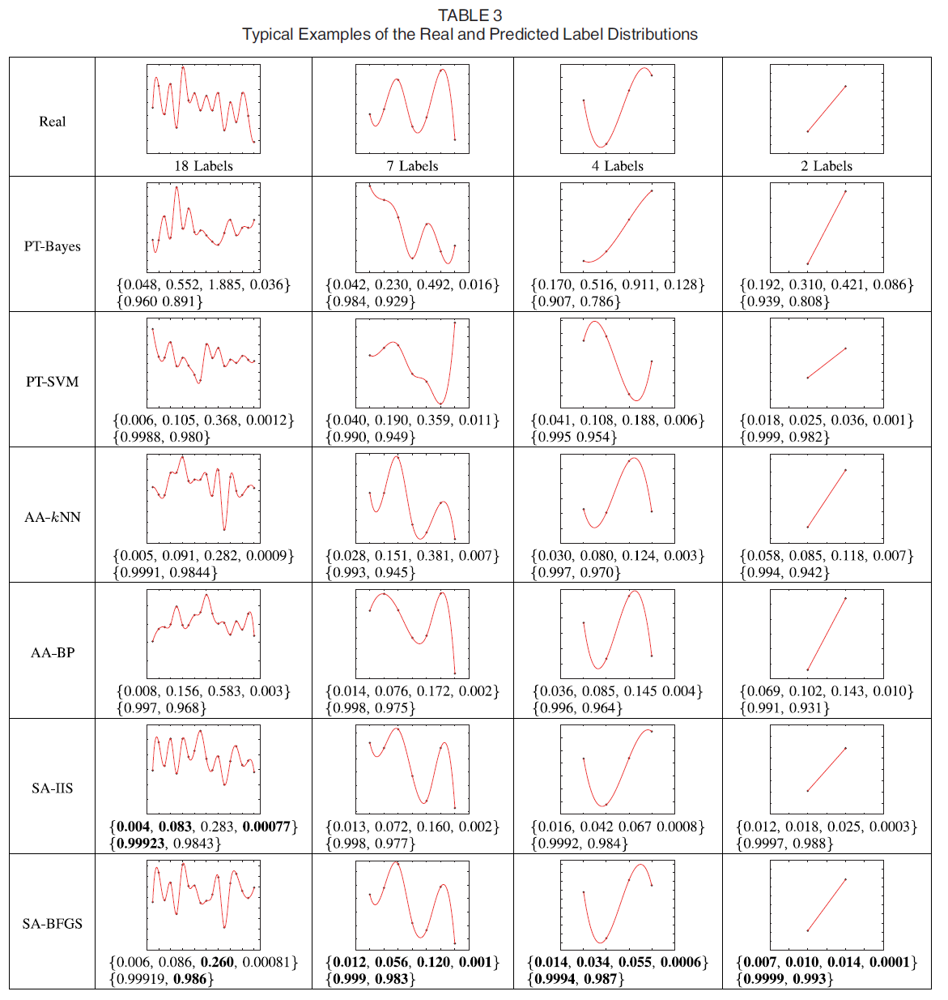
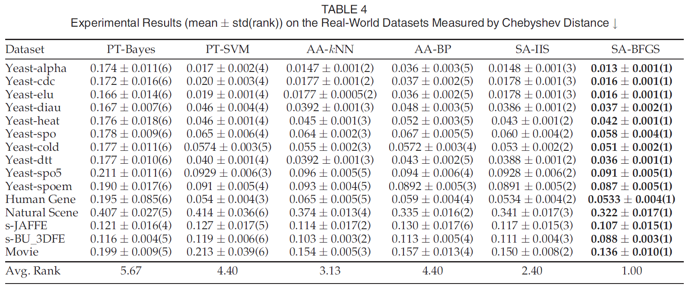

\DeclareMathOperator*{\argmin}{argmin}
\DeclareMathOperator*{\argmax}{argmax}
\usepackage{amsbsy}

Geng, 2016, Label distribution learning, *IEEE Transactions on Knowledge and Data Engineering*. [pdf](https://ieeexplore.ieee.org/abstract/document/7439855?casa_token=zEswd3iNxJIAAAAA:n1kpltbPeA89czcvDQQkO3MLSROswLp9g-nOu1oy0Zk11SK68PH8XfJ_TXG4DjWQeVVekIAD3uA)

***

## Formulation of LDL

  * Notation
    + Input space: $\mathbf{x} \in \mathcal{X} = \mathbb{R}^q$
    + Complete set of labels: $\mathcal{Y} = \{ y_1, \cdots, y_c \}$
    + Label distribution of $\mathbf{x}_i$: $D_i = \{ d_{\mathbf{x}_i}^{y_1}, \cdots, d_{\mathbf{x}_i}^{y_c} \}$
    + Description degree of $y$ to $\mathbf{x}$: $d_{\mathbf{x}}^y$
    + $d_{\mathbf{x}}^y \in [0,1]$ and $\sum_y d_{\mathbf{x}}^y = 1$
    + Training set: $S = \{ (\mathbf{x}_1, D_1), \cdots, (\mathbf{x}_n, D_n) \}$
  * Learn a conditional probability mass function $p(y|\mathbf{x})$ from $S$, where $\mathbf{x} \in \mathcal{X}$ and $y \in \mathcal{Y}$
  * Optimization formulation
    + Given a parametric model $p(y|\mathbf{x} ; \theta)$, the goal of LDL is to find $\theta$ that can generate a distribution similar to $D_i$, given $\mathbf{x}_i$
    + Example: Kullback-Leibler divergence
\begin{equation}
\begin{split}
& \argmin_{\theta} \sum_i \sum_j \left( d_{\mathbf{x}_i}^{y_j} \log{\frac{d_{\mathbf{x}_i}^{y_j}}{p(y_j|\mathbf{x}_i ; \theta)}} \right) \\
= \quad & \argmax_{\theta} \sum_i \sum_j d_{\mathbf{x}_i}^{y_j} \log{p(y_j|\mathbf{x}_i ; \theta)}
\end{split}
\end{equation}
    + When $d_{\mathbf{x}_i}^{y_j} = I(y_j = y(\mathbf{x}_i))$, single label learning
\begin{equation}
\argmax_{\theta} \sum_i \log{p(y(\mathbf{x}_i)|\mathbf{x}_i ; \theta)}
\end{equation}
    + When each instance is associated with a specific label set, multi-label learning
\begin{equation}
\argmax_{\theta} \sum_i \frac{1}{|Y_i|} \sum_{y \in Y_i} \log{p(y | \mathbf{x}_i ; \theta)}
\end{equation}

  * LDL may be viewed as a more general learning framework which includes both SLL and MLL as its special cases
  
 

 

***

## Proposed method

#### Problem transformation: LDL into SLL

  * Each $(\mathbf{x}_i, D_i)$ is transformed into $c$ single labels examples $(\mathbf{x}_i, y_j)$ with the weight $d_{\mathbf{x}_i}^{y_j}$
  * The learner must be able to output the confidence/probability for each labe $y_j$
  * PT-Bayes: Naive Bayes, posterior probability computed by the Bayes rule
  * PT-SVM: pairwise coupling multi-class method (Wu et al., 2004) and improved implementation of Platt's posterior probability (Lin et al., 2007)

#### Algorithm adaptation

  * AA-kNN
  
\begin{equation}
  p(y_j|\mathbf{x}) = \frac{1}{k} \sum_{i \in N_k (\mathbf{x})} d_{\mathbf{x}_i}^{y_j}
\end{equation}

  * AA-BP
    + Three-layer neural network
    + Softmax activation function is used in each output node where $\eta_j$ is the input to the $j$-th output node
    + Loss: MSE
\begin{equation}
  z_j = \frac{\exp(\eta_j)}{\sum_{l=1}^c \exp(\eta_l)}
\end{equation}

#### Specialized algorithms

  * Maximum entropy model (Berger et al., 1996)
\begin{equation}
  p(y | \mathbf{x} ; \theta) = \frac{1}{Z} \exp{\left( \sum_k \theta_{y,k} g_k (\mathbf{x}) \right)}
\end{equation}
    + Normalization factor $Z = \sum_y \exp{(\sum_l \theta_{y,l} g_l (\mathbf{x}))}$
    + $\theta_{y,k}$: $k$-th element of $\theta$
    + $g_k (\mathbf{x})$: $k$-th feature of $\mathbf{x}$
  * SA-IIS (Specialized Algorithm - Improved Iterative Scaling)
\begin{equation}
\begin{split}
  T(\theta) = & \sum_i \sum_j d_{\mathbf{x}_i}^{y_j} \log{p(y_j|\mathbf{x}_i ; \theta)} \\
= & \sum_i \sum_j d_{\mathbf{x}_i}^{y_j} \log{\left( \frac{1}{Z} \exp{\left( \sum_k \theta_{y_j,k} g_k (\mathbf{x}) \right)} \right)}
\end{split}
\end{equation}
    + The optimization of $T(\theta)$ uses a strategy similar to IIS (Improved Iterative Scaling, Della Pietra et al., 1997), a well-knowd algorithm for maximizing the likelihood of the maximum entropy model
    + IIS starts with an arbitrary set of parameters
    + For each step, it updates the current estimate of the parameters $\theta$ to $\theta + \Delta$
    + $\Delta$ maximizes a lower bound to the change in likelihood $\Omega = T(\theta + \Delta) - T(\theta)$
    + The element of $\Delta$, $\delta_{y_j, k}$ can be obtained by solving the equation
\begin{equation}
\sum_i p(y_j | \mathbf{x}_i ; \theta) g_k (\mathbf{x}_i) \exp{\left( \delta_{y_j, k} s(g_k (\mathbf{x}_i)) g^{\#} (\mathbf{x}_i) \right)} - \sum_i d_{\mathbf{x}_i}^{y_j} g_k (\mathbf{x}_i) = 0
\end{equation}
    + $s(g_k (\mathbf{x}_i))$: sign of $g_k (\mathbf{x}_i)$
    + $g^{\#} (\mathbf{x}_i) = \sum_k |g_k (\mathbf{x}_i)|$
    + For detailed derivation, see the appendix
    + Use non-linear equation solvers, such as the Gauss-Newton method
 

 
  * SA-BFGS
    + Minimization of $T'(\theta) = -T(\theta)$ using BFGS method
    + Current estimate $\theta ^{(t)}$, update step $\Delta = \theta ^{(t+1)} - \theta ^{(t)}$
\begin{equation}
T'(\theta ^{(t+1)}) \approx T'(\theta ^{(t)}) + \nabla T'(\theta ^{(t)})^T \Delta + \frac{1}{2} \Delta ^T H(\theta ^{(t)}) \Delta
\end{equation}
    + $\nabla T'(\theta ^{(t)})$: gradient of $T'(\theta)$ at $\theta ^{(t)}$
    + $H(\theta ^{(t)})$: Hessian matrix of $T'(\theta)$ at $\theta ^{(t)}$
    + The minimizer of the above equation is
\begin{equation}
\Delta ^{(t)} = -H^{-1} (\theta ^{(t)}) \nabla T'(\theta ^{(t)})
\end{equation}
    + The line search Netwon method uses $\Delta ^{(t)}$ as the search direction $p^{(t)} = \Delta ^{(t)}$ and update the parameter by
\begin{equation}
\theta ^{(t+1)} = \theta ^{(t)} + \alpha ^{(t)} p^{(t)}
\end{equation}
    + Step length $\alpha ^{(t)}$ is obtained from a line search procedure to satisfy the strong Wolfe conditions
\begin{equation}
T'(\theta ^{(t)} + \alpha ^{(t)} p^{(t)}) \leq T'(\theta) + c_1 \alpha ^{(t)} \nabla T'(\theta ^{(t)})^T p^{(t)}
\end{equation}
\begin{equation}
\left| \nabla T'(\theta ^{(t)} + \alpha ^{(t)} p^{(t)})^T p^{(t)} \right| \leq c_2 \left| \nabla T'(\theta ^{(t)})^T p^{(t)} \right|
\end{equation}
\begin{equation}
0 \leq c_1 \leq c_2
\end{equation}
    + Inverse Hessian matrix in each iteration is computaionally expensive
    + BFGS: avoiding explicit calculation of $H^{-1} (\theta ^{(t)})$ by approximating it with an iteratively updated matrix $B$
\begin{equation}
\begin{split}
s^{(t)} & = \theta ^{(t+1)} - \theta ^{(t)} \\
u^{(t)} & = \nabla T'(\theta ^{(t+1)}) - \nabla T'(\theta ^{(t)}) \\
\rho ^{(t)} & = \frac{1}{s^{(t)} u^{(t)}} \\
B^{(t+1)} & = (I - \rho ^{(t)} s^{(t)} (u^{(t)})^T) B^{(t)} (I - \rho ^{(t)} u^{(t)} (s^{(t)})^T) + \rho ^{(t)} s^{(t)} (s^{(t)})^T \\
\frac{\partial T'(\theta)}{\partial \theta _{y_j,k}} & = \sum_i \frac{\exp\left( \sum_k \theta _{y_j,k} g_k(\mathbf{x}_i) \right) g_k(\mathbf{x}_i)}{\sum_j \exp{\left(\sum_k \theta _{y_j,k} g_k(\mathbf{x}_i) \right)}} - \sum_i d_{\mathbf{x}_i}^{y_j} g_k (\mathbf{x}_i)
\end{split}
\end{equation}

 

 

***

## Experiment

#### Evaluation Measures

  * Distance/similarity between probability distributions
  * From (Cha, 2007)
 

 

  
#### Datasets

  * Artificial dataset
    + Training dataset: $D = \{ d_{\mathbf{x}}^{y_1}, d_{\mathbf{x}}^{y_2}, d_{\mathbf{x}}^{y_3}\}$, $\mathbf{x} = [x_1, x_2, x_3]^T \sim Unif(-1,1)$, 500 instances
\begin{equation}
\begin{split}
t_i & = x_i + 0.5 x_i^2 + 0.2 x_i^3 + 1, \quad i = 1, 2, 3 \\
\psi _1 & = (4 t_1 + 2 t_2 + t_3)^2 \\
\psi _2 & = (t_1 + 2 t_2 + 4 t_3 + 0.01 \psi _1)^2 \\
\psi _3 & = (t_1 + 4 t_2 + 2 t_3 + 0.01 \psi _2)^2 \\
d_{\mathbf{x}}^{y_i} & = \frac{\psi _i}{\psi _1 + \psi _2 + \psi _3}, \quad i = 1, 2, 3
\end{split}
\end{equation}
    + Test dataset: $x_1$ and $x_2$ from the grid of the interval 0.01 within the range $[-1,1]$, i.e. 40,401 test instances
\begin{equation}
x_3 = \sin{(\pi (x_1 + x_2))}
\end{equation}

  * Real-world dataset
    + Yeast- (Eisen et al., 1998)
    + Human Gene (Yu et al., 2012)
    + Natural Scene (Geng and Luo, 2014)
    + Facial expression: JAFFE (Lyons et al., 1998), BU_3DFE (Yin et al., 2006)
    + Movie: Netflix
 

 

#### Methodology

  * 10 cross validation with parameter search

#### Results

  * Artifical dataset

 

 

 

  * Real-world dataset
 

 

 

***

## Further study

  * Berger et al., 1996, **A maximum entropy approach to natural language processing**, *Computational linguistics*. [pdf](https://www.cs.colorado.edu/~mozer/Teaching/syllabi/6622/papers/MaxEntNLP.pdf)
  * Bengio et al., 2010, **Label embedding trees for large multi-class tasks**, *Advances in Neural Information Processing Systems*. [pdf](http://papers.nips.cc/paper/4027-label-embedding-trees-for-large-multi-class-tasks.pdf)
  * Caruana, 1997, **Multitask learning**, *Machine Learning*. [pdf](https://link.springer.com/article/10.1023/A:1007379606734)
  * Lampert et al., 2013, **Attribute-based classification for zero-shot visual object categorization**, *IEEE Transactions on Pattern Analysis and Machine Intelligence*. [pdf](https://hannes.nickisch.org/papers/articles/lampert13attributes.pdf)
  * Nickel et al., 2011, **A three-way model for collective learning on multi-relational data**, *International Conference on Machine Learning*. [pdf](https://www.dbs.ifi.lmu.de/~tresp/papers/ICML2011-final.pdf)
  * Quost and Denoeux, 2009, **Learning from data with uncertain labels by boosting credal classifiers**, *ACM SIGKDD Workshop on Knowledge Discovery from Uncertain Data*. [pdf](https://dl.acm.org/doi/pdf/10.1145/1610555.1610561)
  * Raykar et al., 2010, **Learning from crowds**, *Journal of Machine Learning Research*. [pdf](https://www.jmlr.org/papers/volume11/raykar10a/raykar10a.pdf)
  * Wu et al., 2004, **Probability estimates for multi-class classification by pairwise coupling**, *Journal of Machine Learning Research*. [pdf](https://www.jmlr.org/papers/volume5/wu04a/wu04a.pdf)
  * Zhang and Zhou, 2006, **Multilabel neural networks with applications to functional genomics and text categorization**, *IEEE Transactions on Knowledge and Data Engineering*. [pdf](http://citeseerx.ist.psu.edu/viewdoc/download?doi=10.1.1.130.7318&rep=rep1&type=pdf)
  * Zhang and Zhang, 2007, **Multi-instance multi-label learning with application to scene classification**, *Advances in Neural Information Processing Systems*. [pdf](http://papers.nips.cc/paper/3047-multi-instance-multi-label-learning-with-application-to-scene-classification.pdf)

***

## References

  * Berger et al., 1996, **A maximum entropy approach to natural language processing**, *Computational linguistics*. [pdf](https://www.cs.colorado.edu/~mozer/Teaching/syllabi/6622/papers/MaxEntNLP.pdf)
  * Cha, 2007, **Comprehensive survey on distance/similarity measures between probability density functions**, *International Journal of Mathematical Models and Methods in Applied Sciences*. [pdf](http://citeseerx.ist.psu.edu/viewdoc/download?doi=10.1.1.154.8446&rep=rep1&type=pdf)
  * Della Pietra et al., 1997, **Inducing features of random fields**, *IEEE Transactions on Pattern Analysis and Machine Intelligence*. [pdf](https://ieeexplore.ieee.org/abstract/document/588021)
  * Eisen et al., 1998, **Cluster analysis and display of genome-wide expression patterns**, *National Academy of Sciences*. [pdf](https://www.pnas.org/content/95/25/14863.short)
  * Geng and Luo, 2014, **Multilabel ranking with inconsistent rankers**, *IEEE Conference on Computer Vision and Pattern Recognition*. [pdf](https://www.cv-foundation.org/openaccess/content_cvpr_2014/html/Geng_Multilabel_Ranking_with_2014_CVPR_paper.html)
  * Lin et al., 2007, **A note on Platt’s probabilistic outputs for support vector machines**, *Machine Learning*. [pdf](https://link.springer.com/article/10.1007/s10994-007-5018-6)
  * Lyons et al., 1998, **Coding facial expressions with gabor wavelets**, *IEEE International Conference on Automatic Face and Gesture Recognition*. [pdf](https://ieeexplore.ieee.org/abstract/document/670949/)
  * Wu et al., 2004, **Probability estimates for multi-class classification by pairwise coupling**, *Journal of Machine Learning Research*. [pdf](https://www.jmlr.org/papers/v5/wu04a.html?907d3908)
  * Yin et al., 2006, **A 3D facial expression database for facial behavior research**, *IEEE International Conference on Automatic Face and Gesture Recognition*. [pdf](https://ieeexplore.ieee.org/abstract/document/1613022/)
  * Yu et al., 2012, **Discriminate the falsely predicted protein-coding genes in Aeropyrum Pernix K1 genome based on graphical representation**, *Match-Communications in Mathematical and Computer Chemistry*. [pdf](http://www.bioprotection.org/articles/DNA-19.pdf)

***

