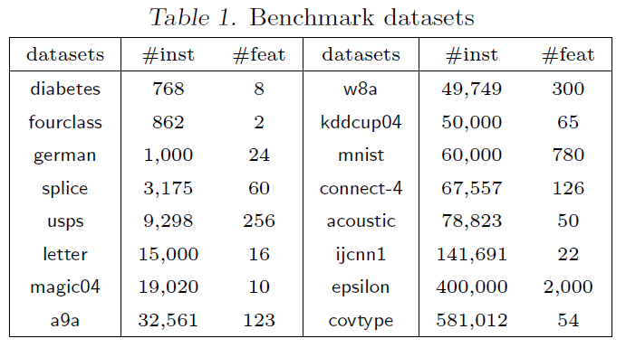
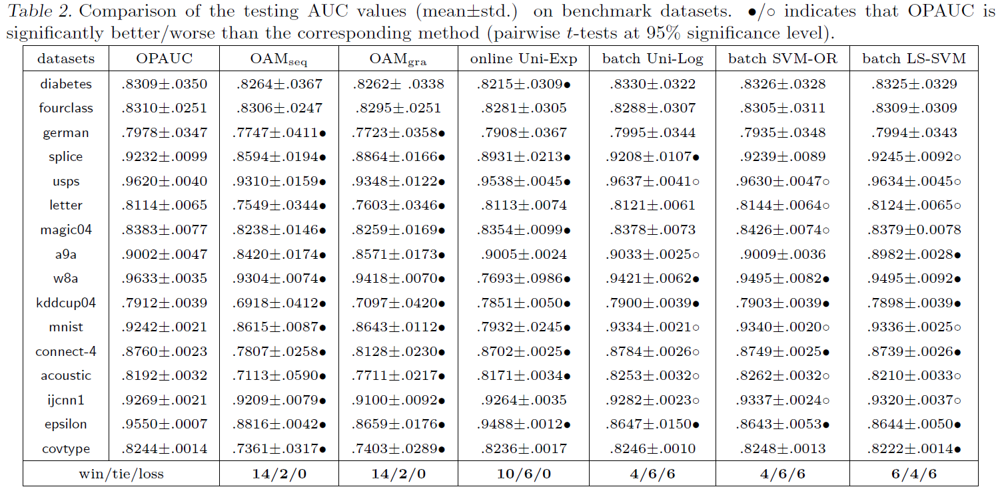

\DeclareMathOperator*{\argmin}{argmin}
\DeclareMathOperator*{\argmax}{argmax}
\usepackage{amsmath}


Gao et al., 2013, **One-pass AUC optimization**, *ICML*. [pdf](https://scholar.google.co.kr/scholar?cluster=16210065053805563556&hl=ko&as_sdt=0,5)


***


## Motivation


  * AUC is measured by a sum of losses defined over pairs of instances from different classes
  * This causes a problem in applications involving big data or streaming data in which a large volume of data come in a short time period 
  * In this work, one-pass AUC optimization that requires going through the training data only once without storing the entire training dataset is proposed


***


## Preliminaries


  * Instance space $\mathcal{X} \in \mathbb{R}^d$
  * Label set $\mathcal{Y} = \{ -1, +1 \}$
  * Unknown distribution $\mathcal{D}$ over $\mathcal{X} \times \mathcal{Y}$
  * A training sample of $n_{+}$ positive instances and $n_{-}$ negative ones
  * Training set $\mathcal{S} = \{ (\mathbf{x}_1^{+}, +1), \cdots, (\mathbf{x}_{n_{+}}^{+}, +1), (\mathbf{x}_1^{-}, -1), \cdots, (\mathbf{x}_{n_{-}}^{-}, -1) \}$
  * Real-valued function $f: \mathcal{X} \rightarrow \mathbb{R}$
  * AUC of $f$ on $\mathcal{S}$

\begin{equation}
\sum_{i=1}^{n_{+}} \sum_{j=1}^{n_{-}} \frac{\mathbb{I}[f(\mathbf{x}_{i}^{+}) > f(\mathbf{x}_{j}^{-})]}{n_{+} n_{-}}
\end{equation}

  * In practice, AUC optimization is approximated by an optimization problem that minimizes the following objective function where $l$ is a loss function
  * Here, linear classifier $f(\mathbf{x}) = \mathbf{w}^\text{T} \mathbf{x}$ and square loss are used
  
\begin{equation}
L(\mathbf{w}) = \frac{\lambda}{2} \lVert \mathbf{w} \rVert _2^2 + \sum_{i=1}^{n_{+}} \sum_{j=1}^{n_{-}} \frac{(1 - \mathbf{w}^\text{T} (\mathbf{x}_i^+ - \mathbf{x}_j^-))^2}{2 n_{+} n_{-}}
\end{equation}


***


## OPAUC


  * Modifying the overall loss $L(\mathbf{w})$ as a sum of losses for individual training instances
  * For i.i.d. sequence $\mathcal{S}_t = \{ (\mathbf{x}_1, y_1), \cdots, (\mathbf{x}_t, y_t) \}$, the loss of $\mathbf{x}_t$ is calculated by using former instances with the opposite sign of $y_t$

\begin{equation}
L_t(\mathbf{w}) = \frac{\lambda}{2} \lVert \mathbf{w} \rVert _2^2 + \frac{\sum_{i=1}^{t-1} \mathbb{I}[y_t \neq y_i](1 - y_t \mathbf{w}^\text{T} (\mathbf{x}_t - \mathbf{x}_i))^2}{2 \left| \{ i \in [t-1] : y_i y_t = -1 \} \right|}
\end{equation}

  * R example

\begin{equation}
\begin{split}
& a_t = \sum_{i=1}^{t-1} \mathbb{I}[y_t \neq y_i](1 - y_t \mathbf{w}^\text{T} (\mathbf{x}_t - \mathbf{x}_i))^2 \\[10pt]
& A_n = \sum_{i=1}^{n_{+}} \sum_{j=1}^{n_{-}} (1 - \mathbf{w}^\text{T} (\mathbf{x}_i^+ - \mathbf{x}_j^-))^2 = a_1 + \cdots + a_n
\end{split}
\end{equation}

```{r}
##### Toy example #####
n.pos <- 5
n.neg <- 10
n <- n.pos + n.neg
f.pos <- runif(n = n.pos, min = 0, max = 1)
f.neg <- runif(n = n.neg, min = -1, max = 1)
f <- c(f.pos, f.neg) # classifier output
y <- c(rep(1, n.pos), rep(-1, n.neg))
dt <- data.frame(y, f)
dt <- dt[sample(x = 1:n, size = n),]
dt <- data.frame(t = 1:n, dt)
rownames(dt) <-  NULL
dt
```

```{r}
##### Define functions #####
fn.auc <- function(y, yhat) {
  ix.pos <- which(y == 1)
  ix.neg <- which(y == -1)
  if (length(ix.neg) == 0 | length(ix.pos) == 0) {
    stop(paste0("Positive: ", length(ix.pos), ", Negative: ", length(ix.neg)))
  }
  diff.pair <- sapply(X = yhat[ix.pos], FUN = function(x) {
    return(x - yhat[ix.neg])
  })
  diff.pair <- as.numeric(diff.pair)
  auc <- sum(diff.pair > 0) / (length(ix.pos) * length(ix.neg))
  return(auc)
}


fn.A.n <- function(y, yhat) {
  ix.pos <- which(y == 1)
  ix.neg <- which(y == -1)
  if (length(ix.neg) == 0 | length(ix.pos) == 0) {
    stop(paste0("Positive: ", length(ix.pos), ", Negative: ", length(ix.neg)))
  }
  diff.pair <- sapply(X = yhat[ix.pos], FUN = function(x) {
    return(x - yhat[ix.neg])
  })
  diff.pair <- as.numeric(diff.pair)
  return(sum((1 - diff.pair)^2))
}


fn.a.t <- function(y, yhat) {
  # Target: last element
  ix.target <- length(y)
  ix.pair <- which(y != y[ix.target])
  if (length(ix.pair) == 0) {
    stop(paste0("No data opposite in sign of y.target"))
  }
  diff.pair <- yhat[ix.target] - yhat[ix.pair]
  return(sum((1 - y[ix.target] * diff.pair)^2))
}
```

```{r}
##### Result #####
res <- data.frame(dt, AUC = 0, A.n = 0, a.t = 0, cumsum.a.t = 0, AUC.square = 0, AUC.square.t = 0)
st <- which(diff(dt$"y") != 0)[1] + 1
for (t in st:n) {
  # t <- st
  res$"AUC"[t] <- fn.auc(y = dt$"y"[1:t], yhat = dt$"f"[1:t])
  res$"A.n"[t] <- fn.A.n(y = dt$"y"[1:t], yhat = dt$"f"[1:t])
  res$"a.t"[t] <- fn.a.t(y = dt$"y"[1:t], yhat = dt$"f"[1:t])
  n.neg.t <- sum(res$"y"[1:t] == -1)
  n.pos.t <- sum(res$"y"[1:t] == 1)
  res$"AUC.square"[t] <- res$"A.n"[t] / (n.neg.t * n.pos.t)
  res$"AUC.square.t"[t] <- res$"a.t"[t] / (n.neg.t * n.pos.t)
}
res$"cumsum.a.t" <- cumsum(res$"a.t")
res <- round(x = res, digits = 4)
res
```


***


## Gradients


  * $X_t^+$ and $X_t^-$: the sets of positive and negative instances in $\mathcal{S}_t$
  * $T_t^+$ and $T_t^-$: their respective cardinality
  * For $y_t = 1$, (trick: $+ \mathbf{c}_t^- [\mathbf{c}_t^-]^\text{T} \mathbf{w} - \mathbf{c}_t^- [\mathbf{c}_t^-]^\text{T} \mathbf{w}$)

\begin{aligned}
\nabla L_t(\mathbf{w}) & = \lambda \mathbf{w} + \mathbf{x}_t \mathbf{x}_t^\text{T} \mathbf{w} - \mathbf{x}_t + \sum_{i:y_i = -1} \frac{(\mathbf{x}_i + (\mathbf{x}_i \mathbf{x}_i^\text{T} - \mathbf{x}_i \mathbf{x}_t^\text{T} - \mathbf{x}_t \mathbf{x}_i^\text{T}) \mathbf{w})}{T_t^-} \\[10pt]
& = \lambda \mathbf{w} - \mathbf{x}_t + \mathbf{c}_t^- + (\mathbf{x}_t - \mathbf{c}_t^-)(\mathbf{x}_t - \mathbf{c}_t^-)^\text{T} \mathbf{w} + S_t^- \mathbf{w}
\end{aligned}

  * Mean vector of negative class at $t$

\begin{equation}
c_t^- = \sum_{i:y_i = -1} \frac{\mathbf{x}_i}{T_t^-}
\end{equation}

  * Covariance matrix of negative class at $t$

\begin{equation}
S_t^- = \sum_{i:y_i = -1} \frac{\mathbf{x}_i \mathbf{x}_i^\text{T} - \mathbf{c}_t^- [\mathbf{c}_t^-]^\text{T}}{T_t^-}
\end{equation}

  * For $y_t = -1$, in a similar manner

\begin{equation}
\nabla L_t(\mathbf{w}) = \lambda \mathbf{w} + \mathbf{x}_t - \mathbf{c}_t^+ + (\mathbf{x}_t - \mathbf{c}_t^+)(\mathbf{x}_t - \mathbf{c}_t^+)^\text{T} \mathbf{w} + S_t^+ \mathbf{w}
\end{equation}


***


## Algorithm
  * Initialize $\Gamma_0^- = \Gamma_0^+ = [\mathbf{0}]_{d \times d}$ where $u = d$
  * At each iteration, set $S_t^+ = \Gamma_t^+$ and $S_t^- = \Gamma_t^-$

\begin{aligned}
& \Gamma_t^+ = \Gamma_{t-1}^+ + \frac{\mathbf{x}_t \mathbf{x}_t^\text{T} - \Gamma_{t-1}^+}{T_t^+} + \mathbf{c}_{t-1}^+ [\mathbf{c}_{t-1}^+]^\text{T} - \mathbf{c}_{t}^+ [\mathbf{c}_{t}^+]^\text{T} \\[10pt]
& \Gamma_t^- = \Gamma_{t-1}^- + \frac{\mathbf{x}_t \mathbf{x}_t^\text{T} - \Gamma_{t-1}^-}{T_t^-} + \mathbf{c}_{t-1}^- [\mathbf{c}_{t-1}^-]^\text{T} - \mathbf{c}_{t}^- [\mathbf{c}_{t}^-]^\text{T}
\end{aligned}

<br>

<br>


***


## Theoretical Analysis


  * **Theorem 1.** For square loss $l(t) = (1-t)^2$, the surrogate loss $\Psi(f, \mathbf{x}, \mathbf{x}') = l(f(\mathbf{x}) - f(\mathbf{x}'))$ is consistent with AUC
  * **Theorem 2.** Let $\mathbf{w}_{\star} = \argmin_{\mathbf{w}} \sum_t L_t(\mathbf{w})$. For $\lVert \mathbf{x}_t \rVert \leq 1 \; \; (t \in [T])$, $\lVert \mathbf{w}_{\star} \rVert \leq B$ and $TL^{\star} \geq \sum_{t=1}^T L_t(\mathbf{w})$, we have the followings where $\kappa = 4 + \lambda$ and $\eta_t = 1 / (\kappa + \sqrt{\kappa^2 + \kappa T L^{\star}/B^2})$

\begin{equation}
\sum_t L_t (\mathbf{w}_t) - \sum_t L_t (\mathbf{w}_{\star}) \leq 2 \kappa B^2 + B \sqrt{2 \kappa T L^{\star}}
\end{equation}

  * Theorem 2 presents an $\mathcal{O}(1/T)$ convergence rate for the OPACU algorithm if the distribution is separable, i.e., $L^{\star} = 0$, and an $\mathcal{O}(1/\sqrt{T})$ convergence rate for general case


***


## Experiments


  * 16 benchmark datasets
  * Features have been scaled to $[-1,1]$ for all datasets
  * Multi-class datasets have been transformed into binary ones by randomly partitioning classes into two groups, where each group contains the same number of classes

<br>

<br>

  * Comparison method
    + $\text{OAM}_{\text{seq}}$, $\text{OAM}_{\text{gra}}$: (Zhao et al., 2011)
    + $\text{online Uni-Exp}$: an online learning algorithm which optimizes the weighted univariate exponential loss (Kotlowski et al., 2011)
    + $\text{batch Uni-log}$: a batch learning algorithm which optimized the weighted univariate logistic loss (Kotlowski et al., 2011)
    + $\text{batch SVM-OR}$: A batch learning algorithm which optimized the pairwise hinge loss (Joachims, 2006)
    + $\text{batch LS-SVM}$: A batch learning algorithm which optimizes the pairwise square loss
  * 5-fold cross validation to decide $\eta_t \in 2^{[-12:10]}$, $\lambda \in 2^{[-10:2]}$
  * Performance evaluation measured by 5 trials of 5-fold cross validation

<br>

<br>


***


## Further Study


  * Zhao et al., 2011, **Online AUC maximization**, *International Conference on Machine Learning*. [pdf](https://scholar.google.co.kr/scholar?cluster=3998144449274225696&hl=ko&as_sdt=0,5)
  * Cortes and Mohri, 2004, **AUC optimization vs. error rate minimization**, *Advances in Neural Information Processing Systems*. [pdf](https://scholar.google.co.kr/scholar?cluster=3571958290589699987&hl=ko&as_sdt=0,5)
  * Joachims, 2005. **A support vector method for multivariate performance measures**, *International Conference on Machine Learning*. [pdf](https://scholar.google.co.kr/scholar?cluster=14930548401865894598&hl=ko&as_sdt=0,5)


***


## References


  * Joachims, 2006, **Training linear svms in linear time**, *International Conference on Machine Learning*. [pdf](https://scholar.google.co.kr/scholar?cluster=210048792073380161&hl=ko&as_sdt=0,5)
  * Kotlowski et al., 2011, **Bipartite ranking through minimization of univariate loss**, *International Conference on Machine Learning*. [pdf](https://scholar.google.co.kr/scholar?cluster=17930403155227738788&hl=ko&as_sdt=0,5)


***


## Note


  * Kernel formulation for nonlinear classification
  * Extension to other loss functions using $L_t(\mathbf{w})$ formulation

