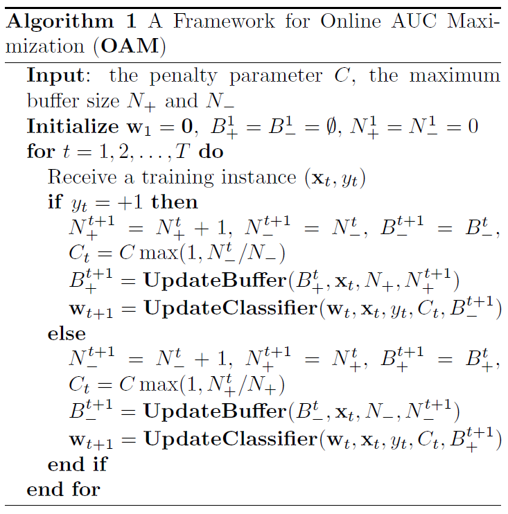
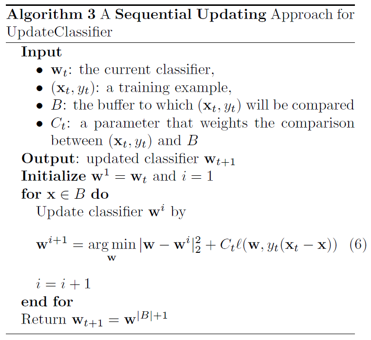
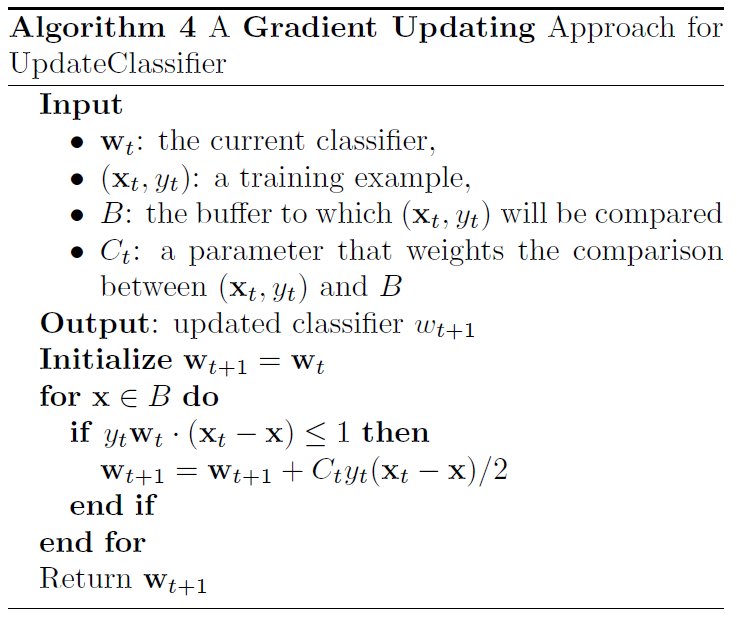
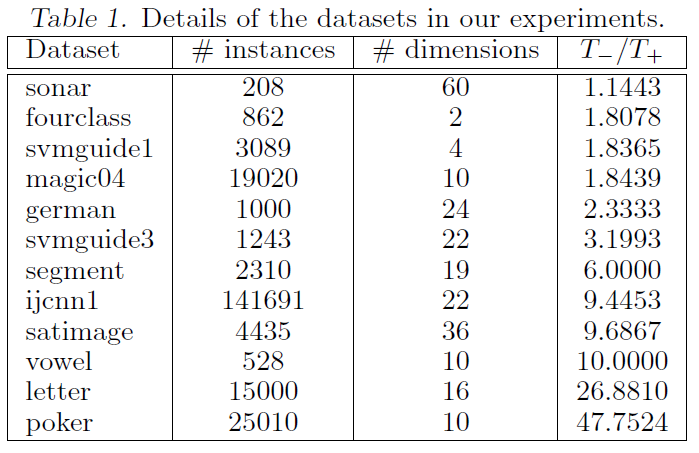
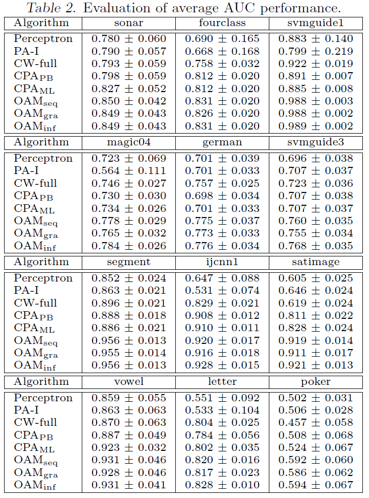
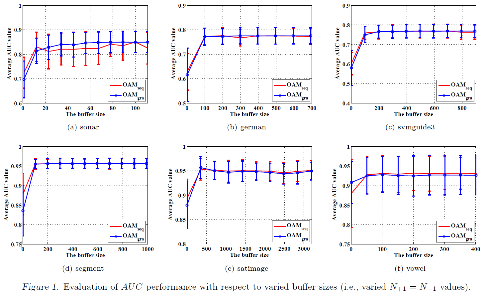

\DeclareMathOperator*{\argmin}{argmin}
\DeclareMathOperator*{\argmax}{argmax}
\usepackage{amsmath}

Zhao et al., 2011, **Online AUC Maximization**, *ICML*. [pdf](https://scholar.google.co.kr/scholar?cluster=3998144449274225696&hl=ko&as_sdt=0,5)

***

## Motivation

  * Most studies of online learning measure the performance of a learner by classification accuracy, which is inappropriate for applications where the data are unevenly distributed among different classes
  * AUC maximization needs to optimize the pairwise loss between two instances from different classes, making it unattractive for large-scale applications
  * The authors address this challenge by exploiting the reservoir sampling

***

## Preliminaries

  * $(\mathbf{x}_t, y_t)$: the training examples received at the $t$-th trial where $\mathbf{x}_t \in \mathbb{R}^d$ and $y_t \in \{ -1, 1\}$
  * Training dataset: $\mathcal{D} = \{ (\mathbf{x}_i, y_i) \in \mathbb{R} \times \{ -1, 1\} | i \in [T] \}$
  * The set of positive instances: $\mathcal{D}_+ = \{ (\mathbf{x}_i^+, 1) | i \in [T_+] \}$
  * The set of negative instances: $\mathcal{D}_- = \{ (\mathbf{x}_j^-, -1) | j \in [T_-] \}$
  * $T_+$, $T_-$: the number of positive and negative instances
  * Linear classifier: $\mathbf{w} \cdot \mathbf{x}$

\begin{equation}
\begin{split}
\text{AUC} (\mathbf{w}) & = \frac{\sum_{i=1}^{T^+} \sum_{j=1}^{T_-} \mathbb{I} (\mathbf{w} \cdot \mathbf{x}_i^+ > \mathbf{w} \cdot \mathbf{x}_j^-)}{T_+ T_-} \\[10pt]
& = 1 - \frac{\sum_{i=1}^{T^+} \sum_{j=1}^{T_-} \mathbb{I} (\mathbf{w} \cdot \mathbf{x}_i^+ \leq \mathbf{w} \cdot \mathbf{x}_j^-)}{T_+ T_-}
\end{split}
\end{equation}

  * Using hinge loss $l(\mathbf{w}, \mathbf{x} - \mathbf{x}')$, optimal classifier by minimizing the following objective

\begin{equation}
\frac{1}{2} \lVert \mathbf{w} \rVert _2^2 + C \sum_{i=1}^{T_+} \sum_{j=1}^{T_-} \max \{ 0, 1 - \mathbf{w} \cdot (\mathbf{x}_i^+ - \mathbf{x}_j^-) \}
\end{equation}

***

## Settings for online learning

  * Re-writing the pairwise summation into a sum of losses for individual instances

\begin{equation}
\begin{split}
& L_+^t (\mathbf{w}) = \sum_{k=1}^{t-1} \mathbb{I}(y_{k} = -1) l(\mathbf{w}, \mathbf{x}_t - \mathbf{x}_{k}) \\[10pt]
& L_-^t (\mathbf{w}) = \sum_{k=1}^{t-1} \mathbb{I}(y_{k} = 1) l(\mathbf{w}, \mathbf{x}_t - \mathbf{x}_{k}) \\[10pt]
& L_t (\mathbf{w}) = \mathbb{I}(y_t = 1) L_+^t (\mathbf{w}) + \mathbb{I}(y_t = -1) L_-^t (\mathbf{w}) \\[10pt]
& \frac{1}{2} \lVert \mathbf{w} \rVert _2^2 + C \sum_{t=1}^T L_t (\mathbf{w})
\end{split}
\end{equation}

  * Directly applying the gradient descent based online learning algorithm (Zinkevich and Martin, 2003) needs to store all the received training examples, making it impractical for large-scale online learning tasks
  * Caching a small number of received training examples by introducing two buffers
  * Two buffers $B_+$ and $B_-$ of size $N_+$ and $N_-$
  * For example $(\mathbf{x}_t, y_t)$ received at trail $t$, first update the two buffers, and then update the linear classifier using two buffers
  * $\mathbb{E}[ \cdot ]$: expectation over the randomly sample instances in buffers

 

 

***

## Update Buffer

  * Maintaining an accurate sketch of history under the constraint of fixed buffer size
  * Reservoir sampling (Vitter and Scott, 1985)
    + Given $(\mathbf{x}_t, y_t)$
    + Add it to the buffer $B_{y_t}^t$ if $|B_{y_t}^t| < N_{y_t}$
    + Otherwise, with probability $N_{y_t} / N_{y_t}^{t+1}$, update the buffer $B_{y_t}^t$ by randomly replacing one instance in $B_{y_t}^t$ with $\mathbf{x}_t$
  * The instances in the buffers simulate an uniform sampling from the original dataset
  * **Lemma 1.** For any function $f: \mathbb{R}^d \to \mathbb{R}$ and at any iteration $t$, we have

\begin{equation}
\begin{split}
& \frac{1}{|B_+^t|} \mathbb{E} \left[ \sum_{\mathbf{x} \in B_+^t} f(\mathbf{x}) \right] = \frac{1}{N_+^t} \sum_{i=1}^{t} \mathbb{I} (y_t = 1) f(\mathbf{x}_i) \\[10pt]
& \frac{1}{|B_-^t|} \mathbb{E} \left[ \sum_{\mathbf{x} \in B_-^t} f(\mathbf{x}) \right] = \frac{1}{N_-^t} \sum_{i=1}^{t} \mathbb{I} (y_t = -1) f(\mathbf{x}_i)
\end{split}
\end{equation}

***

## Update Classifier

#### Sequential Updating
  * Treating $\{ (\mathbf{x}_t, \mathbf{x}), \mathbf{x} \in B \}$ as a sequence of pairwise instances
  * Applying an online learning algorithm to update $\mathbf{w}$ w.r.t. the sequence of pairwise instances
  * **Theorem 1.** After running the Algorithm 1 with the sequential updating in Algorithm 3 and reservoir sampling, for any $\mathbf{w}$, we have the following where $T_+$ and $T_-$ are the total number of positive and negative instances received over $T$ trials.

\begin{equation}
\mathbb{E} \left[ \sum_{t=1}^T L_t (\mathbf{w}) \right] \leq \sum_{t=1}^T L_t (\mathbf{w}) + \frac{\lVert \mathbf{w} \rVert _2^2}{C} + \frac{C}{3} (N_+ T_+^3 + N_- T_-^3)
\end{equation}

  * For the optimization problem (6), its closed-form solution is given by $\mathbf{w}^{i+1} = \mathbf{w}^i + \tau y_t (\mathbf{x}_t - \mathbf{x})$ where $\tau$ can be computed by
  
\begin{equation}
\tau = \min{ \left\{ \frac{C_t}{2}, \frac{l(\mathbf{w}^i, y_t (\mathbf{x}_t - \mathbf{x}))}{\lVert \mathbf{x}_t - \mathbf{x} \rVert _2^2} \right\} }
\end{equation}

 

 

#### Gradient Updating

 

 

> Error in Algorith 3, 4: not $\text{for } \mathbf{x} \in B$, but $\text{for } \mathbf{x} \in B_{-y_t}$

***

## Experiments

  * 12 datasets from LIBSVM website and UCI ML repository
  * 5-fold cross validation with 4 independent repetitions
  * $N_- = N_+ = 100$ and $C \in 2^{[-10:10]}$
  * Compared methods
    + $\text{Perceptron}$: Rosenblatt's perceptron
    + $\text{PA}$: Passive-Aggressive algorithm (Crammer et al., 2006)
    + $\text{CW-full}$: confidence-based weighted online learning algorithm (Crammer et al., 2008)
    + $\text{CPA}_\text{PB}$: Prediction-Based Cost-sensitive Passive-Aggressive algorithm (Crammer et al., 2006)
    + $\text{CPA}_\text{ML}$: Max-Loss Cost-sensitive Passive-Aggressive algorithm (Crammer et al., 2006)
    + $\text{OAM}_\text{seq}$: OAM with sequential updating
    + $\text{OAM}_\text{gra}$: OAM with gradient updating
    + $\text{OAM}_\text{inf}$: OAM with infinite buffer size

 

 

 

 

***

## Further Study

  * Cortes and Mohri, 2004, **AUC optimization vs. error rate minimization**, *Advances in Neural Information Processing Systems*. [pdf](https://scholar.google.co.kr/scholar?cluster=3571958290589699987&hl=ko&as_sdt=0,5)
  * Joachims, 2005. **A support vector method for multivariate performance measures**, *International Conference on Machine Learning*. [pdf](https://scholar.google.co.kr/scholar?cluster=14930548401865894598&hl=ko&as_sdt=0,5)

***

## References

  * Crammer et al., 2006, **Online passive-aggressive algorithms**, *Journal of Machine Learning Research*. [pdf](https://www.jmlr.org/papers/v7/crammer06a)
  * Crammer et al., 2008, **Exact convex confidence-weighted learning**, *Advances in Neural Information Processing Systems*. [pdf](https://proceedings.neurips.cc/paper/2008/hash/68ce199ec2c5517597ce0a4d89620f55-Abstract.html)
  * Vitter and Scott, 1985, **Random sampling with a reservoir**, *ACM Transactions on Mathematical Software*. [pdf](https://scholar.google.co.kr/scholar?cluster=12477259931641459543&hl=ko&as_sdt=0,5)
  * Zinkevich and Martin, 2003, **Online convex programming and generalized infinitesimal gradient ascent**, *International Conference on Machine Learning*. [pdf](https://www.aaai.org/Papers/ICML/2003/ICML03-120.pdf)

***

## Note

  * Kernel formulation for nonlinear classification
  * Extension to other loss functions using $L_t(\mathbf{w})$ formulation

