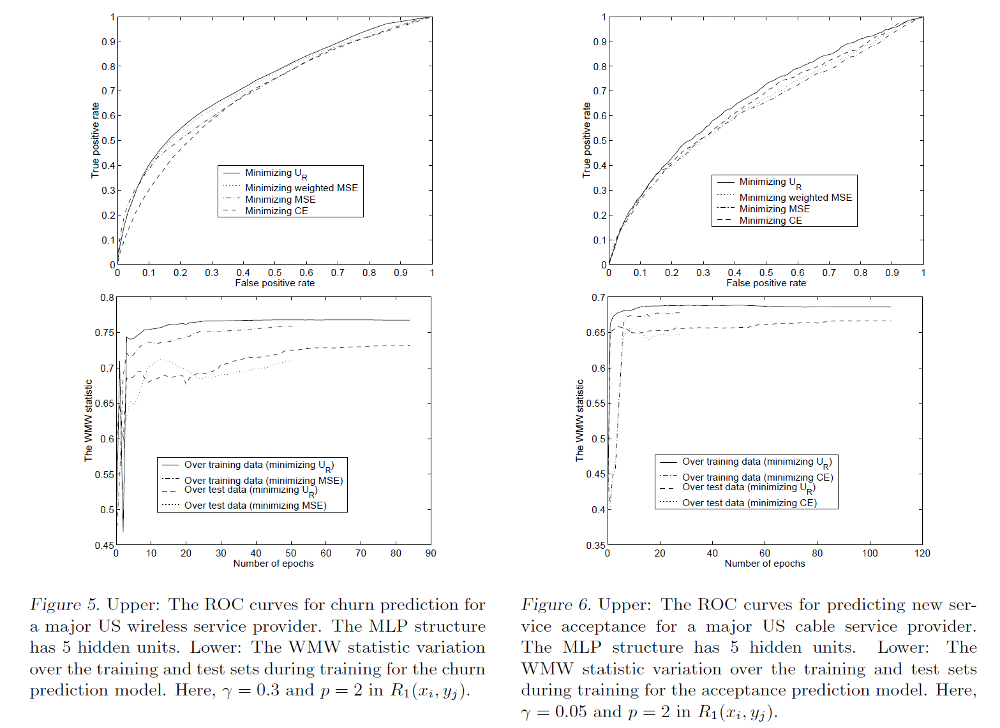

Yan et al., 2003, Optimizing classifier performance via an approximation to the Wilcoxon-Mann-Whitney statistic, *International Conference on Machine Learning*. [pdf](https://www.aaai.org/Papers/ICML/2003/ICML03-110.pdf)


***


## Introduction


  * Relationship between AUC and WMW statistic
    + Minimizing cross entropy or mean squared error does not necessarily maximize the area under the ROC curve (AUC)
    + Let $\{ x_0 , \cdots , x_{m-1} \}$ as the classifier outputs for $m$ positive examples, and $\{ y_0 , \cdots , y_{n-1} \}$ for $n$ negative examples
    + $X$ and $Y$ are random variable
    + Wilcoxon-Mann-Whitney (WMW) statistic $U$ is an estimator of AUC $\textit{P} (X > Y)$

$$U = \frac{ \sum_{i=0}^{m-1} \sum_{j=0}^{n-1} I(x_i , y_j)}{mn}$$

$$\begin{equation*}
I(x_i , y_j) = \begin{cases}
1 & x_i > y_j \\
0 & \text{otherwise} 
\end{cases}
\end{equation*}$$

  * Difficulty of optimizing AUC directly
    + AUC itself is non-differentiable and cannot be optimized by gradient based methods
    + In the information retrieval field, some related work exists on optimizing ranks


***


## Proposed method


  * Differentiable approximation to $I$
    + A larger $\beta$ would make $S$ close to $I$, but this bring in numerical prolbem during optimization because of steep gradients
    + During the process of minimizing $R_1$, when a positive samples has a higher output than a negative sample by a margin $\gamma$, this pair of samples will not contribute to the objective function
    + The influence of the training samples is adaptively adjusted according to the pairwise comparisons during training
    + Positive margin $\gamma$ is need for better generalization
    + Maximizing $R_2$ is ineffective because it makes the optimization focus on maximizing the difference between $x_i$ and $y_j$ rather than on moving more pairs of $x_i$ and $y_j$ to satisfy $x_i - y_j > \gamma$


```{r, echo = FALSE, fig.align = "center", fig.height = 4, fig.width = 4}
fn.s <- function(x, beta) {
  return(1 / (1 + exp(- beta * x)))
}
fn.r1 <- function(x, gamma, p) {
  if (x < gamma) {
    z <- (-(x - gamma))^p
  } else {
    z <- 0
  }
  return(z)
}
fn.r2 <- function(x, gamma, p) {
  if (x > gamma) {
    z <- (x - gamma)^p
  } else {
    z <- 0
  }
  return(z)
}
fn.i <- function(x) {
  if (x > 0) {
    z <- 1
  } else {
    z <- 0
  }
  return(z)
}
x <- seq(from = -1, to = 1, by = 0.001)
ind <- c() ; s <- c() ; r1 <- c() ; r2 <- c()
for (i in 1:length(x)) {
  ind[i] <- fn.i(x = x[i])
  s[i] <- fn.s(x = x[i], beta = 2)
  r1[i] <- fn.r1(x = x[i], gamma = 0.3, p = 2)
  r2[i] <- fn.r2(x = x[i], gamma = 0.1, p = 2)
}
plot(x = x, y = ind, ylim = range(c(ind, s, r1, r2)), xlab = "x - y", ylab = "Loss", type = "l", lwd = 3)
lines(x = x, y = s, type = "l", lwd = 3, col = "red", lty = 2)
lines(x = x, y = r1, type = "l", lwd = 3, col = "blue", lty = 3)
lines(x = x, y = r2, type = "l", lwd = 3, col = "deepskyblue", lty = 4)
l1 <- latex2exp::TeX("$S, \\beta = 1$")
l2 <- latex2exp::TeX("$R_{1}, \\gamma = 0.3, p = 2$")
l3 <- latex2exp::TeX("$R_{2}, \\gamma = 0.1, p = 2$")
legend("topright", bty = "n", legend = c(l1, l2, l3), col = c("red", "blue", "deepskyblue"), lty = c(2, 3, 4), lwd = c(2, 2, 2))
```

$$S(x_i, y_j) = \frac{1}{1 + \exp{\{ - \beta (x_i - y_j) \}}}$$

$$\begin{equation*}
R_1 (x_i , y_j) = \begin{cases}
(-(x_i - y_j - \gamma))^p & x_i - y_j < \gamma \\
0  & \text{otherwise} 
\end{cases}
\end{equation*}$$

$$\begin{equation*}
R_2 (x_i , y_j) = \begin{cases}
(x_i - y_j - \gamma)^p & x_i - y_j > \gamma \\
0  & \text{otherwise} 
\end{cases}
\end{equation*}$$


***

  
## Experiment
  + Churn prediction: 140,000 customers, 6% churn rate, 55 features, positive weight 2 in weighted MSE
  + Cross-sell acceptance prediction: 260,00 customers, 0.6% positive sample, 41 features, positive weight 10 in weighted MSE





***


## Further study
  + Hand and Till, 2001, A simple generalisation of the area under the ROC curve for multiple class classification problems, *Machine learning*. [pdf](https://link.springer.com/article/10.1023%2FA%3A1010920819831)


***


## Note
  + Other approximation (margin-based loss functions)
  + Determination of $\gamma$ (in view of the difficulty of a classification problem)
  + Determination of $\beta$ and $p$ (I think they have a similar effect to ...)

