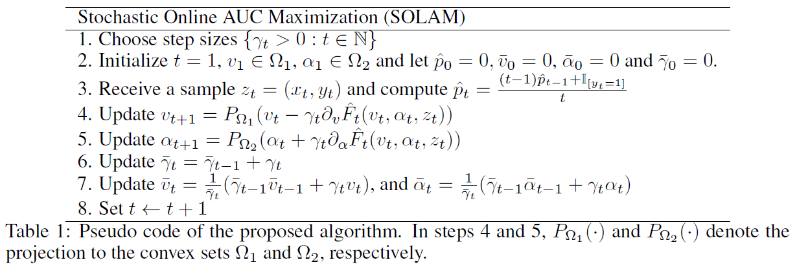
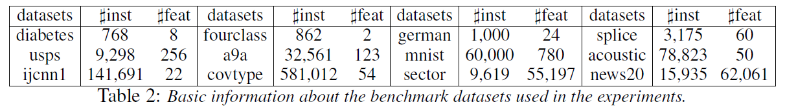
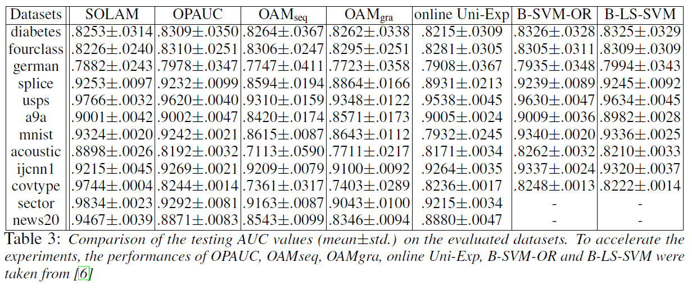
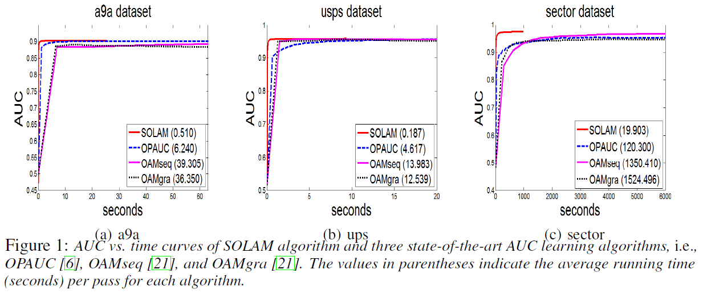

\DeclareMathOperator*{\argmin}{argmin}
\DeclareMathOperator*{\argmax}{argmax}
\usepackage{amsmath}


Ying et al., 2016, **Stochastic online AUC maximization**, *NIPS*. [pdf](https://papers.nips.cc/paper/2016/file/c52f1bd66cc19d05628bd8bf27af3ad6-Paper.pdf)


***


## Introduction
  * Topic: online learning algorithms that maximize AUC for large-scale data
  * Challenge: learning objective is usually defined over a pair of training examples of opposite classes
  * Proposed method
    + AUC optimization can be equivalently formulated as a convex-concave saddle point problem (SPP)
    + From this SPP representation, a stochastic online algorithm (SOLAM) is proposed which has time and space complexity of one datum


***


## Background
  * Input space $\mathcal{X} \subseteq \mathbb{R}^d$
  * Output space $\mathcal{Y} = \{ -1, 1\}$
  * Training data $\mathbf{z} = \{ (x_i, y_i) \}_{i = 1}^n$: i.i.d. sample from unknown distribution $\rho$ on $\mathcal{Z} = \mathcal{X} \times \mathcal{Y}$
  * Scoring function $f: \mathcal{X} \to \mathbb{R}$
  * AUC: the probability of a positive sample ranks higher than a negative sample

\begin{equation}
\begin{split}
\argmax_f \; \text{AUC}(f) & = \argmax_f \; \Pr(f(x) \geq f(x') | y = 1, y' = -1) \\[10pt]
& = \argmin_f \; \mathbb{E} [\mathbb{I} (f(x') - f(x) > 0) | y = 1, y' = -1]
\end{split}
\end{equation}

  * Squared loss has been shown to be statistically consistent with AUC (Gao and Zhou, 2015)
  * In this work, squared loss and linear classifier are used
  * Let $p = \Pr (y=1)$
  * For any random variable $\xi (z)$, conditional expectation is defined by $\mathbb{E} [\xi(z) | y=1] = \frac{1}{p} \int \int \xi(z) \mathbb{I}(y = 1) d\rho(z)$
  * Bounded solution $\lVert \mathbf{w} \rVert _1 \leq R$
  * AUC maximization can be formulated by

\begin{equation}
\begin{split}
& \argmin _{\lVert \mathbf{w} \rVert _1 \leq R} \; \mathbb{E} [(1 - \mathbf{w}^\text{T} (x - x'))^2 | y = 1, y' = -1] \\[10pt]
= \; & \argmin _{\lVert \mathbf{w} \rVert _1 \leq R} \; \frac{1}{p(1-p)} \int \int_{\mathcal{Z} \times \mathcal{Z}} (1 - \mathbf{w}^\text{T} (x - x'))^2 \mathbb{I}(y = 1) \mathbb{I}(y' = -1) d\rho(z) d\rho(z')
\end{split}
\end{equation}

  * $n^+$, $n^-$: the number of instances in the positive and negative classes
  * Applying empirical risk minimization principle

\begin{equation}
\argmin _{\lVert \mathbf{w} \rVert _1 \leq R} \frac{1}{n^+ n^-} \sum_{i=1}^{n} \sum_{j=1}^{n} (1 - \mathbf{w}^\text{T} (x_i - x_j))^2 \mathbb{I}(y_i = 1 \land y'_j = -1)
\end{equation}


***


## Saddle Point Problems (SPP)

\begin{equation}
\min_{u \in \mathcal{U}} \; \max_{v \in \mathcal{V}} \; g(u, v)
\end{equation}

  * $g$ is a smooth convex-concave function
  * $g(\cdot, v)$ is convex for all $v \in \mathcal{V}$
  * $g(u, \cdot)$ is concave for all $u \in \mathcal{U}$
  * A saddle point solution to the problem is a pair $(u^{\star}, v^{\star}) \in \mathcal{U} \times \mathcal{V}$ such that

\begin{equation}
g(u^{\star}, v) \leq g(u^{\star}, v^{\star}) \leq g(u, v^{\star}) \quad \forall \; u \in \mathcal{U}, \; v \in \mathcal{V}
\end{equation}

```{r echo = FALSE, message = FALSE, fig.width = 8, fig.height = 8}
# Data generation for visualization
x1 <- seq(from = -1, to = 1, by = 0.1)
x2 <- x1
z <- matrix(data = 0, nrow = length(x1), ncol = length(x2))
for (i in 1:length(x1)) {
  for (j in 1:length(x2)) {
    z[i, j] <- x1[i]^2 - x2[j]^2
  }
}

# 3D visualization using plotly
library(plotly)
fig <- plot_ly(x = x1, y = x2, z = z, type = "surface", colorscale = "Picnic")
fig <- fig %>% layout(title = TeX("f(u, v) = u^2 - v^2"),
                      scene = list(
                        xaxis = list(title = "v"),
                        yaxis = list(title = "u"),
                        zaxis = list(title = "f")
                        ))
fig <- fig %>% config(mathjax = 'cdn')
fig
```


***


## Equivalent Representation as a SPP

  * **Theorem 1.** The AUC optimization is equivalent to

\begin{equation}
\min_{\begin{array}{c} \lVert \mathbf{w} \rVert _1 \leq R \\[-2pt] (a, b) \in \mathbb{R}^2 \end{array}} \; \max_{\alpha \in \mathbb{R}} \; f(\mathbf{w}, a, b, \alpha) := \int_{\mathcal{Z}} F(\mathbf{w}, a, b, \alpha ; z) d\rho(z)
\end{equation}

\begin{equation}
\begin{split}
F(\mathbf{w}, a, b, \alpha ; z) & = (1 - p) (\mathbf{w}^{\text{T}} x - a)^2 \mathbb{I}(y = 1) + p (\mathbf{w}^{\text{T}} x - b)^2 \mathbb{I}(y = -1) \\[10pt]
& + 2 (1 + \alpha) (p \mathbf{w}^{\text{T}} x \mathbb{I}(y = -1) - (1 - p) \mathbf{w}^{\text{T}} x \mathbb{I}(y = 1)) - p (1 - p) \alpha^2
\end{split}
\end{equation}

  * Proof omitted (see the paper for more details)


***


## Stocastic First-Order Online Algorithm
  * Gradient descent in the primal variable $(\mathbf{w}, a, b)$
  * Gradient ascent in the dual variable $\alpha$
  * Let $v = (\mathbf{w}^{\text{T}}, a, b)^{\text{T}} \in \mathbb{R}^{d+2}$
  * $\mathbf{w} \in \mathbb{R}^d$, $a, b, \alpha \in \mathbb{R}$, $z = (x, y) \in \mathbb{Z}$
  * We need the knowledge of the unknown probability $p = \Pr(y = 1)$, or $\hat{p}_t = \sum_{i=1}^t \mathbb{I}(y_i = 1) \; / \; t$
  * By the **Theorem 1.**, we need restriction of the solution

\begin{equation}
\begin{split}
& \Omega_1 = \{ (\mathbf{w}, a, b) \; : \; \lVert \mathbf{w} \rVert _1 \leq R, \; |a| \leq R \kappa, \; |b| \leq R \kappa \} \\[10pt]
& \Omega_2 = \{ \alpha \; : \; |\alpha| \leq 2R \kappa \} \\[10pt]
& \kappa = \sup_{x \in \mathcal{X}} \; \lVert x \rVert _1 < \infty
\end{split}
\end{equation}
<br>
\begin{equation}
\hat{F}_t (v, \alpha, z) = 
\begin{cases}
(1 - \hat{p}_t) (\mathbf{w}^{\text{T}} x - a)^2 - 2 (1 + \alpha) (1 - \hat{p}_t) \mathbf{w}^{\text{T}} x - \hat{p}_t (1 - \hat{p}_t) \alpha^2 & \text{if} \quad y = 1 \\[10pt]
\hat{p}_t (\mathbf{w}^{\text{T}} x - b)^2 + 2 (1 + \alpha) \hat{p}_t \mathbf{w}^{\text{T}} x - \hat{p}_t (1 - \hat{p}_t) \alpha^2 & \text{if} \quad y = -1
\end{cases}
\end{equation}
<br>
\begin{equation}
\nabla_{\mathbf{w}} \hat{F}_t (v, \alpha, z) =
\begin{cases}
2 (1 - \hat{p}_t) (\mathbf{w}^{\text{T}} x - a - 1 - \alpha) x & \text{if} \quad y = 1 \\[10pt]
2 \hat{p}_t (\mathbf{w}^{\text{T}} x - b + 1 + \alpha) x & \text{if} \quad y = -1
\end{cases}
\end{equation}
<br>
\begin{equation}
\nabla_{a} \hat{F}_t (v, \alpha, z) =
\begin{cases}
-2 (1 - \hat{p}_t) (\mathbf{w}^{\text{T}} x - a) & \text{if} \quad y = 1 \\[10pt]
0 & \text{if} \quad y = -1
\end{cases}
\end{equation}
<br>
\begin{equation}
\nabla_{b} \hat{F}_t (v, \alpha, z) =
\begin{cases}
0 & \text{if} \quad y = 1 \\[10pt]
-2 \hat{p}_t (\mathbf{w}^{\text{T}} x - b) & \text{if} \quad y = -1
\end{cases}
\end{equation}
<br>
\begin{equation}
\nabla_{\alpha} \hat{F}_t (v, \alpha, z) =
\begin{cases}
- 2 (1 - \hat{p}_t) (\hat{p}_t \alpha + \mathbf{w}^{\text{T}} x) & \text{if} \quad y = 1 \\[10pt]
2 \hat{p}_t (\hat{p}_t \alpha + \mathbf{w}^{\text{T}} x - \alpha) & \text{if} \quad y = -1
\end{cases}
\end{equation}

<br>

<br>

  * In step 6,

\begin{equation}
\begin{split}
& \bar{\gamma}_1 = \bar{\gamma}_0 + \gamma_1 = \gamma_1 \\[10pt]
& \bar{\gamma}_2 = \bar{\gamma}_1 + \gamma_2 = \gamma_1 + \gamma_2 \\[10pt]
& \bar{\gamma}_3 = \bar{\gamma}_2 + \gamma_3 = \gamma_1 + \gamma_2 + \gamma_3 \\[10pt]
& \Rightarrow \bar{\gamma}_k = \sum_{j = 1}^k \gamma_j
\end{split}
\end{equation}

  * In step 7, 8,

\begin{equation}
\begin{split}
& \bar{v}_1 = \frac{1}{\bar{\gamma}_1} (\bar{\gamma}_0 \bar{v}_0 + \gamma_1 v_1) = v_1 \\[10pt]
& \bar{v}_2 = \frac{1}{\bar{\gamma}_2} (\bar{\gamma}_1 \bar{v}_1 + \gamma_2 v_2) = \frac{\gamma_1 v_1 + \gamma_2 v_2}{\gamma_1 + \gamma_2} \\[10pt]
& \bar{v}_3 = \frac{1}{\bar{\gamma}_3} (\bar{\gamma}_2 \bar{v}_2 + \gamma_2 v_2) = \frac{\gamma_1 v_1 + \gamma_2 v_2 + \gamma_3 v_3}{\gamma_1 + \gamma_2 + \gamma_3} \\[10pt]
& \Rightarrow \bar{v}_k = \frac{\sum_{j = 1}^k \gamma_j v_j}{\sum_{j = 1}^k \gamma_j} \\[10pt]
& \Rightarrow \bar{\alpha}_k = \frac{\sum_{j = 1}^k \gamma_j \alpha_j}{\sum_{j = 1}^k \gamma_j}
\end{split}
\end{equation}


***


## Analysis


  * Let $u = (v, \alpha) = (\mathbf{w}, a, b, \alpha)$
  * The quality of an approximation solution $(\bar{v}_t, \bar{\alpha}_t)$ to the SPP problem is measure by the duality gap

\begin{equation}
\epsilon_f (\bar{v}_t \bar{\alpha}_t) = \max_{\alpha \in \Omega_2} f(\bar{v}_t, \alpha) - \min_{v \in \Omega_1} f(v, \bar{\alpha}_t)
\end{equation}

  * **Theorem 2.** Assume that samples $\{ (x_1, y_1), \cdots, (x_T, y_T) \}$ are i.i.d. drawn from a distribution $\rho$ over $\mathcal{X} \times \mathcal{Y}$, let $\Omega_1$, $\Omega_2$ be given by the former section and the step size given by $\{ \gamma_t > 0 : t \in \mathbb{N} \}$. For sequence $\{ (\bar{v}_t, \bar{\alpha}_t) : t \in [1,T] \}$ generated by *SOLAM*, and any $0 < \delta <1$, with probability $1 - \delta$, the following holds where $C_{\kappa}$ is an absolute constant independent of $R$ and $T$

\begin{equation}
\epsilon_f (\bar{v}_t \bar{\alpha}_t) \leq C_{\kappa} \max(R^2, 1) \sqrt{\log{\frac{4T}{\delta}}} (\sum_{j = 1}^T \gamma_j)^{-1} \left( 1 + \sum_{j = 1}^T \gamma_j^2 + (\sum_{j = 1}^T \gamma_j^2)^{1/2} + \sum_{j = 1}^T \frac{\gamma_j}{\sqrt{j}} \right)
\end{equation}

  * **Corollary 1.** Under the same assumptions as in **Theorem 2.**, and $\{ \gamma_j = \zeta j^{-\frac{1}{2}} : j \in \mathbb{N} \}$ with constant $\zeta > 0$, with probability $1 - \delta$ it holds the following

\begin{equation}
|f(\bar{v}_T, \bar{\alpha}_T) - f^{\star}| \leq \epsilon_f (\bar{u}_T) = \mathcal{O} \left( \frac{\log{T} \sqrt{\log{(4T / \delta)}}}{\sqrt{T}} \right)
\end{equation}


***

## Experiments


  * 5-fold cross validation to determine $\zeta \in [1:9:100]$, and $R \in 10^{[-1:1:5]}$ by grid search
  * Averaging results from 5 runs of 5-fold cross validation
  * Multi-class dataset is transformed into binary classification by randomly partitioning the data into two groups, where each group includes the same number of classes
  * Comparison
    + OPAUC (Gao et al., 2013)
    + OAM (Zhao et al., 2011)
    + online Uni-Exp: weighted univariate exponential loss (Kotlowski et al., 2011)
    + B-SVM-OR: batch learning algorithm using the hinge loss surrogate of AUC (Joachims, 2006)
    + B-LS-SVM: batch learning algorithm using $l_2$ loss surrogate of AUC
<br>

<br>

<br>

<br>


***


## Further Study

  * Joachims, 2005, **A support vector method for multivariate performance measures**, *International Conference on Machine Learning*. [pdf](https://icml.cc/imls/conferences/2005/proceedings/papers/048_ASupport_Joachims.pdf)
  * Kotlowski et al., 2011, **Bipartite ranking through minimization of univariate loss**, *International Conference on Machine Learning*. [pdf](https://icml.cc/2011/papers/567_icmlpaper.pdf)
  * Rakhlin et al., 2012, **Making gradient descent optimal for strongly convex
stochastic optimization**, *International Conference on Machine Learning*. [pdf](https://icml.cc/Conferences/2012/papers/261.pdf)
  * Ying and Zhou, 2016, **Online pairwise learning algorithms**, *Neural Computation*. [pdf](https://arxiv.org/pdf/1502.07229.pdf)


***


## References


  * Gao et al., 2013, **One-pass AUC optimization**, *International Conference on Machine Learning*. [pdf](http://proceedings.mlr.press/v28/gao13.pdf), [summary](https://haaforever.github.io/blog/post/2020/12/07/one-pass-auc-optimization/)
  * Gao and Zhou, 2015, **On the consistency of AUC pairwise optimization**, *International Joint Conference on Artificial Intelligence*. [pdf]()
  * Joachims, 2006, **Training linear svms in linear time**, *International Conference on Knowledge Discovery and Data Mining*. [pdf](http://web.engr.oregonstate.edu/~huanlian/teaching/machine-learning/2017fall/extra/linear-svm-linear-time.pdf)
  * Kotlowski et al., 2011, **Bipartite ranking through minimization of univariate loss**, *International Conference on Machine Learning*. [pdf](https://icml.cc/2011/papers/567_icmlpaper.pdf)
  * Zhao et al., 2011, **Online AUC maximization**, *International Conference on Machine Learning*. [pdf](http://www.icml-2011.org/papers/198_icmlpaper.pdf), [summary](https://haaforever.github.io/blog/post/2020/12/07/online-auc-maximization/)

