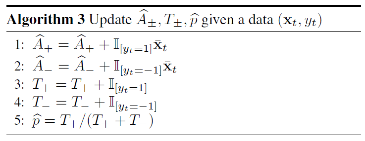
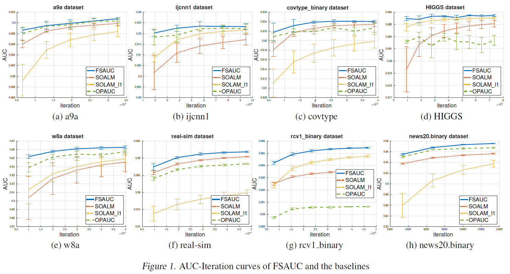

\DeclareMathOperator*{\argmin}{argmin}
\DeclareMathOperator*{\argmax}{argmax}
\usepackage{amsmath}

Liu et al., 2016, **Fast stochastic AUC maximization with** $O(1/n)$ **convergence rate**, *ICML*. [pdf](http://proceedings.mlr.press/v80/liu18g/liu18g.pdf)

***

## Introduction
  * Convergence rate of SOLAM (Ying et al., 2016): $\tilde{\mathcal{O}} (1 / \sqrt{n})$
  * Need to improve the convergence rate of stochastic optimization
  * This paper proposes FSAUC algorithm with convergence rate of $\tilde{\mathcal{O}} (1 / n)$

***

## Background
  * Input space $\mathcal{X} \subseteq \mathbb{R}^d$, output space $\mathcal{Y} = \{ -1, 1\}$
  * Training data $\mathbf{z} = \{ (\mathbf{x}_i, y_i) \}_{i = 1}^n$: i.i.d. sample from unknown distribution $\rho$ on $\mathcal{Z} = \mathcal{X} \times \mathcal{Y}$
  * Scoring function $f: \mathcal{X} \to \mathbb{R}$
  * Using linear classifier $f(\mathbf{x}) = \mathbf{w}^{\text{T}} \mathbf{x}$ and squared loss, the problem of AUC optimization can be formulated as saddle point problem as follow (Ying et al., 2016)

\begin{equation}
\min_{\begin{array}{c} \lVert \mathbf{w} \rVert _2 \leq R \\[-2pt] (a, b) \in \mathbb{R}^2 \end{array}} \; \max_{\alpha \in \mathbb{R}} \; f(\mathbf{w}, a, b, \alpha) := \mathbb{E}_{\mathbf{z}} [F(\mathbf{w}, a, b, \alpha ; z)]
\end{equation}

\begin{equation}
\begin{split}
F(\mathbf{w}, a, b, \alpha ; z) & = (1 - p) (\mathbf{w}^{\text{T}} \mathbf{x} - a)^2 \mathbb{I}(y = 1) + p (\mathbf{w}^{\text{T}} \mathbf{x} - b)^2 \mathbb{I}(y = -1) \\[10pt]
& + 2 (1 + \alpha) (p \mathbf{w}^{\text{T}} x \mathbb{I}(y = -1) - (1 - p) \mathbf{w}^{\text{T}} \mathbf{x} \mathbb{I}(y = 1)) - p (1 - p) \alpha^2
\end{split}
\end{equation}

  * Assume the optimal solution sits in a bounded domain

\begin{equation}
\begin{split}
& \Omega_1 = \{ (\mathbf{w}, a, b) \; : \; \lVert \mathbf{w} \rVert _2 \leq R, \; |a| \leq R \kappa, \; |b| \leq R \kappa \} \\[10pt]
& \Omega_2 = \{ \alpha \; : \; |\alpha| \leq 2R \kappa \} \\[10pt]
& \kappa = \sup_{x \in \mathcal{X}} \; \lVert x \rVert _2 < \infty
\end{split}
\end{equation}

***

## Alrogithm
  * Based on multi-stage scheme (see the paper for references)
  * $\bar{\mathbf{x}} \in \mathbb{R}^{d+2}$: an augmented feature vector with the last two components being 0
  * $\mathcal{B} (c, r) = \{ x: \lVert x - c \rVert _2 \leq r\}$: $L_2$ ball centered at $c$ with a radius $r$
  * Primal variable $\mathbf{v} = (\mathbf{w}^{\text{T}}, a, b)^{\text{T}}$
  * $\prod_{A \cap B}$: projection onto the intersection of two sets $A$ and $B$
  * Description of values
    + $n$: the number of samples
    + $m$: the number of iteration of FSAUC
    + $n_0$: the number of iteration of PDSG
    + $R$: upper bound of $\lVert \mathbf{w} \rVert _2$ (*user*)
    + $R_k$: radius of $\mathbf{v}_1$ ball
    + $G$: for computing the learning rate $\eta_k$ of PDSG (*user*)
    + $\beta_0$: for computing the learning rate $\eta_k$ of PDSG
    + $D_k$: radius of $\alpha_1$ ball
    + $\hat{A}_{\pm}$: cumulative (augmented) feature vector for positive and negative class
    + $T_{\pm}$: the number of positive and negative examples received so far
    + $\hat{p}$: estimated positive ratio based on the received examples
  * Differences between SOLAM and FSAUC
    1. Step size is given as a constant for each call of PDSG
    2. Each update of primal and dual variable is projected into an intersection of their constrained domain $\Omega$ and ball $\mathcal{B}$ centered at the initial solution $\mathbf{v}_1$, $\alpha$
 
 

 
 

 
 

 
 

***

## Convergence Analysis
  * **Theorem 1.** Given $\delta \in (0, 1)$, assume $n$ is sufficiently large such that $n > \max \left( 100, m \frac{32 \log{(12/\delta)}}{(\min{(p, 1-p)})^2} \right)$. Then with probability at least $1 - \delta$, the following holds where $\tilde{\mathcal{O}} (\cdot)$ suppresses logarithmic factor of $\log{n}$ and some constants of the problem independent of $n$

\begin{equation}
\max_{\alpha \in \Omega_2} f(\hat{\mathbf{v}}_m, \alpha) - \min_{\mathbf{v} \in \Omega_1} \max_{\alpha \in \Omega_2} f(\mathbf{v}, \alpha) \leq \tilde{\mathcal{O}} \left( \frac{\log{(1 / \delta)}}{n} \right)
\end{equation}

  * **Lemma 1.** For each call of Algorithm 2, we update $D$, $\beta$ according to the following.
    \begin{equation}
    \begin{split}
    & D = 2 \sqrt{2} \kappa r + \frac{4 \sqrt{2} \kappa (2 + \sqrt{2 \log{(12 / \delta)}}) (1 + 2 \kappa) R}{\sqrt{\min{(\hat{p}, 1 - \hat{p})} T - \sqrt{2 T \log{(12 / \delta)}}}}
\\[10pt]
    & \beta = 1 + 8 \kappa^2 + \frac{32 \kappa^2 (1 + 2 \kappa)^2 (2 + \sqrt{2 \log{(12 / \delta)}})^2}{\min{(\hat{p}, 1 - \hat{p})} - \sqrt{\frac{2 \log{(12 / \delta)}}{T}}}
    \end{split}
    \end{equation}
    Suppose $\lVert \mathbf{v}_1 - \mathbf{v}_{\star} \rVert _2 \leq r$, where $\mathbf{v}_{\star} \in \Omega_1$ is the optimal solution closet to $\mathbf{v}_1$, and $T > \max{\left( \frac{R^2}{r^2}, \frac{32 \log{(12 / \delta)}}{(\min{(p, 1 - p)})^2} \right)}$, then
    \begin{equation}
    \max_{\alpha \in \Omega_2} f(\bar{\mathbf{v}}_T, \alpha) - \min_{\mathbf{v} \in \Omega_1} \max_{\alpha \in \Omega_2} f(\mathbf{v}, \alpha) \leq \frac{(2 \sqrt{3 \gamma_1} + \sqrt{\log{(6T/ \delta)}} \gamma_2) r G}{\sqrt{T}}
    \end{equation}
    where $\gamma_1 = 1 + 8 \kappa^2 + \frac{32 \kappa^2 (1 + 2 \kappa)^2 (2 + \sqrt{2 \log{(12 / \delta)}})^2}{0.5 \min{(p, 1-p)}}$, $\gamma_2 = 16 \left( 1 + 2 \sqrt{2} \kappa + \frac{8 \kappa (2 + \sqrt{2 \log{(12 / \delta)}}) (1 + 2 \kappa)}{\sqrt{0.5 \min{(p, 1-p)}}} \right)$

***

## Experiments
  * Comparison
    + OPAUC (Gao et al., 2013)
    + SOLAM (Ying et al., 2016): $L_2$ norm constraint (original)
    + SOLAM-L1  (Ying et al., 2016): $L_1$ norm constraint
  * Randomly splitting dataset: training, validation, test (4, 1, 1)
  * Parameter setting using validation dataset
    + OPAUC: $\eta \in 2^{[-12:1:-4]}$, $\lambda \in 2^{[-10:1:10]}$
    + SOLAM: $R \in 10^{[-1:1:5]}$, $\text{learning rate} \in 2^{[-10:1:10]}$
    + FSAUC: $R \in 10^{[-1:1:5]}$, $\eta_1 \in 2^{[-10:1:10]}$
  * Test performance over 5 random runs
 
 

 
 

 
 

 
 

***

## References
  * Gao et al., 2013, **One-pass AUC optimization**, *International Conference on Machine Learning*. [pdf](http://proceedings.mlr.press/v28/gao13.pdf), [summary](https://haaforever.github.io/blog/post/2020/12/07/one-pass-auc-optimization/)
  * Ying et al., 2016, **Stochastic online AUC maximization**, *Advances in Neural Information Processing Systems*. [pdf](https://papers.nips.cc/paper/2016/file/c52f1bd66cc19d05628bd8bf27af3ad6-Paper.pdf), [summary](https://haaforever.github.io/blog/post/2020/12/08/stochastic-online-auc-maximization/)

