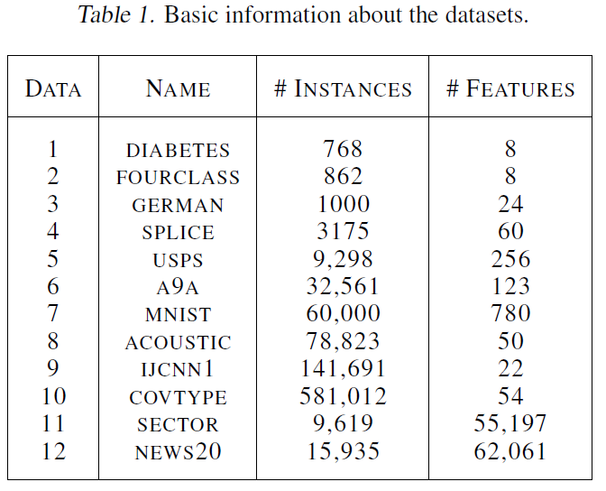
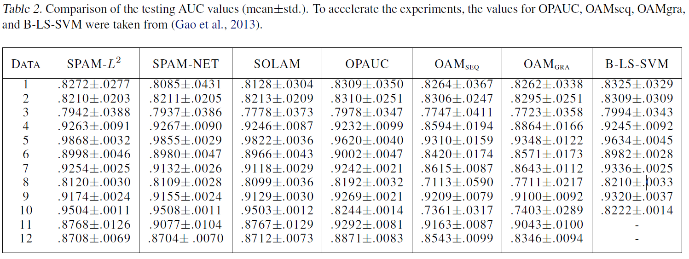
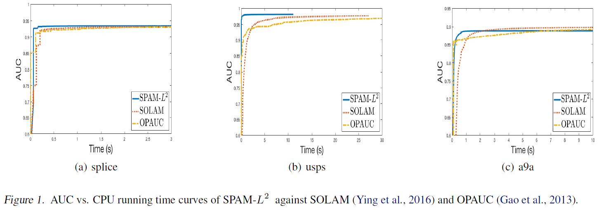

\DeclareMathOperator*{\argmin}{argmin}
\DeclareMathOperator*{\argmax}{argmax}
\usepackage{amsmath}

Natole et al., 2018, **Stochastic proximal algorithms for AUC maximization**, *International Conference on Machine Learning*. [pdf](http://proceedings.mlr.press/v80/natole18a.html)

***

## Introduction
  * Stochastic proximal algorithm for AUC maximization (SPAM)
  * SPAM applies to general non-smooth regularization terms
  * Under the assumption of strong convexity, SPAM can achieve a convergence rate of $\mathcal{O}(\frac{\log{t}}{t})$

***

## Background
  * Input space $\mathcal{X} \subseteq \mathbb{R}^d$
  * Output space $\mathcal{Y} = \{ -1, 1\}$
  * Training data $\mathbf{z} = \{ (x_i, y_i) \}_{i = 1}^n$: i.i.d. sample from unknown distribution $\rho$ on $\mathcal{Z} = \mathcal{X} \times \mathcal{Y}$
  * Scoring function $f: \mathcal{X} \to \mathbb{R}$
  * AUC: the probability of a positive sample ranks higher than a negative sample

\begin{equation}
\begin{split}
\argmax_f \; \text{AUC}(f) & = \argmax_f \; \Pr(f(x) \geq f(x') | y = 1, y' = -1) \\[10pt]
& = \argmin_f \; \mathbb{E} [\mathbb{I} (f(x') - f(x) > 0) | y = 1, y' = -1]
\end{split}
\end{equation}

  * Using squared loss and linear classifier $f(x) = \mathbf{w}^{\text{T}} x$,
  * Here consider the following regularized formulation for AUC maximization

\begin{equation}
\min _{\mathbf{w} \in \mathbb{R}^d} \; \mathbb{E} [(1 - \mathbf{w}^\text{T} (x - x'))^2 | y = 1, y' = -1] + \Omega(\mathbf{w})
\end{equation}

  * Here assume that $\Omega$ is strongly convex with parameter $\beta > 0$
    + For any $\mathbf{w}, \; \mathbf{w}' \in \mathbb{R}^d$, $\Omega(\mathbf{w}) \geq \Omega(\mathbf{w}') + \partial \Omega(\mathbf{w}') \cdot (\mathbf{w} - \mathbf{w}') + \frac{\beta}{2} \lVert \mathbf{w} - \mathbf{w}' \rVert ^2$
    + Frobenius norm: $\beta \lVert \mathbf{w} \rVert ^2$
    + Elastic net: $\beta \lVert \mathbf{w} \rVert ^2 + \nu \lVert \mathbf{w} \rVert _1$

***

## Proposed Method
  * Observe the following

\begin{equation}
\begin{split}
& \mathbb{E}[(1 - \mathbf{w}^{\text{T}} (x - x'))^2 | y = 1, y' = -1] \\[11pt]
= & 1 - 2 \mathbb{E}[\mathbf{w}^{\text{T}} x | y = 1] + 2 \mathbb{E}[\mathbf{w}^{\text{T}} x' | y' = -1] \\[11pt]
+ & (\mathbb{E}[\mathbf{w}^{\text{T}} x | y = 1] - \mathbb{E}[\mathbf{w}^{\text{T}} x' | y' = -1])^2 + \mathbb{V}[\mathbf{w}^{\text{T}} x | y = 1] + \mathbb{V}[\mathbf{w}^{\text{T}} x' | y' = 1]
\end{split}
\end{equation}
 
\begin{equation}
\begin{split}
& (\mathbb{E}[\mathbf{w}^{\text{T}} x | y = 1] - \mathbb{E}[\mathbf{w}^{\text{T}} x' | y' = -1])^2 = \max _{\alpha} \; - \alpha^2 + 2 \alpha (\mathbb{E}[\mathbf{w}^{\text{T}} x' | y' = -1] - \mathbb{E}[\mathbf{w}^{\text{T}} x | y = 1]) \\[11pt]
& \mathbb{V}[\mathbf{w}^{\text{T}} x | y = 1] = \min _{a} \mathbb{E} [(\mathbf{w}^{\text{T}} x - a)^2 | y = 1] \\[11pt]
& \mathbb{V}[\mathbf{w}^{\text{T}} x' | y' = -1] = \min _{b} \mathbb{E} [(\mathbf{w}^{\text{T}} x' - b)^2 | y' = -1]
\end{split}
\end{equation}

  * It is easy to see that the optima for $a$, $b$, $\alpha$ are respectively achieved at the following

\begin{equation}
\begin{split}
& a = \mathbf{w}^{\text{T}} \mathbb{E}[x | y = 1] \\[11pt]
& b = \mathbf{w}^{\text{T}} \mathbb{E}[x' | y' = -1] \\[11pt]
& \alpha = \mathbf{w}^{\text{T}} (\mathbb{E}[x' | y' = -1] - \mathbb{E}[x | y = 1])
\end{split}
\end{equation}

  * Using the similar theorem from (Ying et al., 2016), the above AUC optimization is equivalent to

\begin{equation}
\begin{split}
\min _{\mathbf{w}, a, b} \; \max_{\alpha \in \mathbb{R}} \; & \mathbb{E}_z [F(\mathbf{w}, a, b, \alpha ; z)] + \Omega(\mathbf{w}) \\[11pt]
F(\mathbf{w}, a, b, \alpha ; z) & = (1 - p)(\mathbf{w}^{\text{T}} x - a)^2 \mathbb{I}(y = 1) + p (\mathbf{w}^{\text{T}} x - b)^2 \mathbb{I}(y = -1) \\[11pt]
& + 2 (1 + \alpha) \mathbf{w}^{\text{T}} x (p \mathbb{I}(y = -1) - (1 - p) \mathbb{I}(y = 1)) - p (1 - p) \alpha^2
\end{split}
\end{equation}

  * For fixed $\mathbf{w}$, the optimal for $a$, $b$, $\alpha$ in saddle formulation has the exact formulation as given above
  * This leads to conduct stochastic gradient descent only no $\mathbf{w}$, while $a$, $b$, $\alpha$ are the updated in a deterministic manner
  * The proximal mapping associated with a convex function $\Omega : \mathbb{R}^d \to \mathbb{R}$ is defined as following

\begin{equation}
\text{prox} _{\eta_t, \Omega} (\mathbf{w}) = \argmin_{\mathbf{u}} \frac{1}{2} \lVert \mathbf{u} - \mathbf{w} \rVert ^2 + \eta_t \Omega(\mathbf{w})
\end{equation}

 

 

***

## Convergence Analysis
  * Notations

\begin{equation}
\begin{split}
& f(\mathbf{w}) = p(1 - p) \mathbb{E}[(1 - \mathbf{w}^{\text{T}} (x - x'))^2 | y = 1, y' = -1] \\[11pt]
& \mathbf{w}^{\star} = \argmin_{\mathbf{w} \in \mathbb{R}^d} {f(\mathbf{w}) + \Omega(\mathbf{w})} \\[11pt]
& G(\mathbf{w} ; z) = \partial _1 F(\mathbf{w} ; a(\mathbf{w}), b(\mathbf{w}), \alpha(\mathbf{w}), z) \\[11pt]
& \mathbb{E} [\lVert G(\mathbf{w}^{\star} ; z) - \partial f(\mathbf{w}^{\star})\rVert ^2] = \sigma^2_{\star} \\[11pt]
& C_{\beta, M} = \frac{\beta}{128 M^4} \\[11pt]
& \tilde{C}_{\beta, M} = \frac{\beta}{(1 + \frac{\beta^2}{128 M^4})^2} \\[11pt]
& \bar{C}_{\beta, M} = \tilde{C}_{\beta, M} {\beta, M}
\end{split}
\end{equation}

  * Assumptions
    + (A1) $\Omega(\cdot)$ is $\beta$-strongly convex
    + (A2) There exists and $M > 0$ such that $\lVert x \rVert \leq M$ for any $x \in \mathcal{X}$

  * **Theorem 2.** Under the assumptions (A1), (A2), and choosing step sizes with some $\theta \in (0,1)$ in the form of $\{ \eta_t = \frac{C_{\beta, M}}{t^{\theta}} : t \in \mathbb{N} \}$, the algorithm SPAM achieves the following

\begin{equation}
\begin{split}
\mathbb{E}[\lVert \mathbf{W}_{T+1} - \mathbf{w}^{\star} \rVert ^2] & \leq T^{- \theta}  \exp{\left(\frac{\bar{C}_{\beta, M}}{1 - \theta}\right)\left(\frac{\theta}{e \bar{C}_{\beta, M}}\right)^{\frac{\theta}{1 - \theta}}} \mathbb{E}[\lVert \mathbf{w}_1 - \mathbf{w}^{\star} \rVert ^2] \\[11pt]
& + 2 T^{- \theta} \sigma^2_{\star} C^2_{\beta, M} \left( \frac{9}{(1 - \theta)2^{1 - \theta}} \left( \frac{1}{\bar{C}_{\beta, M} (1 - 2^{\theta - 1}) e} \right)^{\frac{1}{1 - \theta}} + \frac{18}{\bar{C}_{\beta, M}} + 1 \right)
\end{split}
\end{equation}

  * **Theorem 3.** Under the assumptions (A1), (A2), and choosing step sizes $\{ \eta_t = (\tilde{C}_{\beta, M}(t + 1))^{-1} : t \in \mathbb{N} \}$, the algorithm SPAM achieves the following where $t_0 = \max{\left( 2, \left \lceil {1 + \frac{(128 M^4 + \beta^2)^2}{128 M^4 \beta^2}} \right \rceil \right)}$

\begin{equation}
\mathbb{E}[\lVert \mathbf{w}_{T+1} - \mathbf{w}^{\star} \rVert ^2] \leq \frac{1}{T} (t_0 \mathbb{E}[\lVert \mathbf{w}_{t_0} - \mathbf{w}^{\star} \rVert^2]) + \frac{4 \sigma^2_{\star}}{\tilde{C}^2_{\beta, M}} \frac{\log{T}}{T}
\end{equation}

***

## Experiments
  * Methods
    + SPAM-$L^2$: SPAM with Frobenius norm $\Omega (\mathbf{w}) = \frac{\beta}{2} \lVert \mathbf{w} \rVert ^2$
    + SPAM-NET: SPAM with elastic net norm $\Omega (\mathbf{w}) = \frac{\beta}{2} \lVert \mathbf{w} \rVert ^2 + \beta_1 \lVert \mathbf{w} \rVert _1$
    + SOLAM (Ying et al., 2016)
    + OPAUC (Gao et al., 2013)
    + OAMseq and OAMgra (Zhao et al., 2013)
    + B-LS-SVM (Joachims, 2006): a batch learning algorithm for AUC maximization with square loss
  * Proximal step for elastic net norm can be written as

\begin{equation}
\argmin_{\mathbf{w}} \frac{1}{2} \lVert \mathbf{w} - \frac{\hat{\mathbf{w}}_{t+1}}{\eta_t \beta + 1} \rVert^2 + \frac{\eta_t \beta_1}{\eta_t \beta + 1} \lVert \mathbf{w} \rVert_1
\end{equation}

  * 80% training, 20% test with 20 runs
  * 5-fold cross validation on the trainig dataset to determine $\beta \in 10^{[-5:5]}$, $\beta_1 \in 10^{[-5:5]}$

 

 

 

 

***

## References
  * Gao et al., 2013, **One-pass AUC optimization**, *International Conference on Machine Learning*. [pdf](http://proceedings.mlr.press/v28/gao13.pdf), [summary](https://haaforever.github.io/blog/post/2020/12/07/one-pass-auc-optimization/)
  * Joachims, 2006, **Training linear svms in linear time**, *International Conference on Knowledge Discovery and Data Mining*. [pdf](http://web.engr.oregonstate.edu/~huanlian/teaching/machine-learning/2017fall/extra/linear-svm-linear-time.pdf)
  * Ying et al., 2016, **Stochastic online AUC maximization**, *Advances in Neural Information Processing Systems*. [pdf](https://papers.nips.cc/paper/2016/file/c52f1bd66cc19d05628bd8bf27af3ad6-Paper.pdf), [summary](https://haaforever.github.io/blog/post/2020/12/08/stochastic-online-auc-maximization/)
  * Zhao et al., 2011, **Online AUC maximization**, *International Conference on Machine Learning*. [pdf](http://www.icml-2011.org/papers/198_icmlpaper.pdf), [summary](https://haaforever.github.io/blog/post/2020/12/07/online-auc-maximization/)

***

## Further Study
  * Bottou and LeCun, 2003, **Large scale online learning**, *Advances in Neural Information Processing Systems*. [pdf](https://papers.nips.cc/paper/2003/file/9fb7b048c96d44a0337f049e0a61ff06-Paper.pdf)
  * (AdaGrad) Duchi et al., 2011, **Adaptive subgradient methods for online learning and stochastic optimization**, *Journal of Machine Learning Research*. [pdf](https://www.jmlr.org/papers/volume12/duchi11a/duchi11a.pdf?source=post_page---------------------------)
  * Hazan et al., 2012, **Projection-free online learning**, *International Conference on Machine Learning*, [pdf](https://icml.cc/2012/papers/292.pdf)
  * Johnson and Zhang, 2013, **Accelerating stochastic gradient descent using predictive variance reduction**, *Advances in Neural Information Processing Systems*. [pdf](https://papers.nips.cc/paper/2013/file/ac1dd209cbcc5e5d1c6e28598e8cbbe8-Paper.pdf)
  * Parikh and Boyd, 2014, **Proximal algorithms**, *Foundations and Trends in Optimization*. [pdf](http://www.math.uni.wroc.pl/~p-wyk4/opt2019/prox_algs.pdf)
  * Rakhlin et al., 2012, **Making gradient descent optimal for strongly convex stochastic optimization**, *International Conference on Machine Learning*. [pdf](https://icml.cc/Conferences/2012/papers/261.pdf)
  * Shalev-Shwartz, 2011, **Online learning and online convex optimization**, *Foundations and Trends in Machine Learning*. [pdf](https://www.cs.huji.ac.il/~shais/papers/OLsurvey.pdf)
  * Shamir and Zhang, 2013, **Stochastic gradient descent for non-smooth optimization: Convergence results and optimal averaging schemes**, *International Conference on Machine Learning*. [pdf](http://proceedings.mlr.press/v28/shamir13.pdf)
  * Smale and Yao, 2006, **Online learning algorithm**, *Foundations of Computational Mathematics*. [pdf](http://web.mit.edu/~9.520/www/spring08/Papers/online_learning.pdf)
  * Yang and Lin, 2018, **RSG: Beating subgradient method without smoothness and strong convexity**, *Journal of Machine Learning Research*. [pdf](https://jmlr.csail.mit.edu/papers/volume19/17-016/17-016.pdf)
  * Zhang and Xiao, 2017, **Stochastic primal-dual coordinate method for regularized empirical risk minimization**, *Journal of Machine Learning Research*. [pdf](https://jmlr.csail.mit.edu/papers/volume18/16-568/16-568.pdf)
  * Zou and Hastie, 2005, **Regularization and variable selection via the elastic net**, *Journal of the Royal Statistical Society: Series B (Statistical Methodology)*. [pdf](https://www.math.arizona.edu/~hzhang/math574m/Read/elasticnet.pdf)

